# Guide utilisateur — Synelia Cloud

Ce guide décrit, écran par écran, ce que fait Synelia Cloud : la vitrine publique, l'espace
client (`/app`) et l'espace super admin (`/admin`). Les captures ont été prises en environnement
de démonstration (données fictives, jeu de données figé) — les libellés, montants et statuts
correspondent exactement à ce qu'affiche l'interface.

Deux types d'utilisateurs se partagent la plateforme :

- **le client**, une organisation qui souscrit des Espaces Cloud, des projets applicatifs, des
  services managés — c'est l'essentiel de ce guide ;
- **le super admin**, l'équipe qui exploite la plateforme pour le compte de tous les clients —
  couvert plus brièvement en fin de guide.

## Sommaire

1. [Vitrine publique](#1-vitrine-publique)
2. [Espace client — vue d'ensemble](#2-espace-client--vue-densemble)
3. [Infrastructure](#3-infrastructure)
   - [3.1 Espaces Cloud](#31-espaces-cloud)
   - [3.2 Machines virtuelles](#32-machines-virtuelles)
   - [3.3 Kubernetes managé](#33-kubernetes-managé)
   - [3.4 Réseau & Load balancers](#34-réseau--load-balancers)
   - [3.5 Stockage](#35-stockage)
   - [3.6 Bases managées](#36-bases-managées)
   - [3.7 Sauvegarde & PRA](#37-sauvegarde--pra)
4. [Applications](#4-applications)
5. [Web Cloud](#5-web-cloud)
6. [IA & Agents](#6-ia--agents)
7. [IAM & sécurité et Global](#7-iam--sécurité-et-global)
8. [Super admin](#8-super-admin)

---

## 1. Vitrine publique

La vitrine (`/`) est le site public, accessible sans connexion. Elle présente l'offre, les prix
et un simulateur de coût ; c'est là qu'un prospect découvre la plateforme avant de créer un
compte.

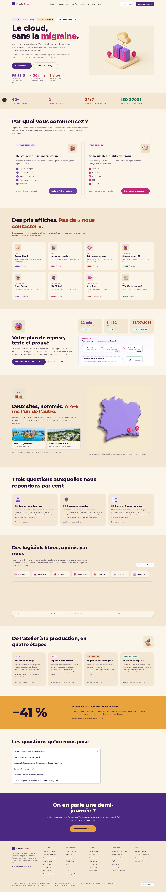

La page d'accueil enchaîne : un accroche avec deux boutons (« Commencer », « Estimer mon
budget »), quatre chiffres clés (disponibilité, délai de première réponse, budget d'un Espace
Cloud, sites), un choix entre « pour les techniciens » (infrastructure : Espace Cloud, machines
virtuelles, Kubernetes, stockage objet) et « pour les métiers » (Drive Pro, Email Pro, Visio &
Chat, GED, ERP), une grille de tarifs par produit, un bloc PRA/DRaaS, une carte de Côte d'Ivoire
situant les deux sites (Abidjan · Synertech Vallon et Grand-Bassam · VITIB), les questions
fréquentes et un CTA final.

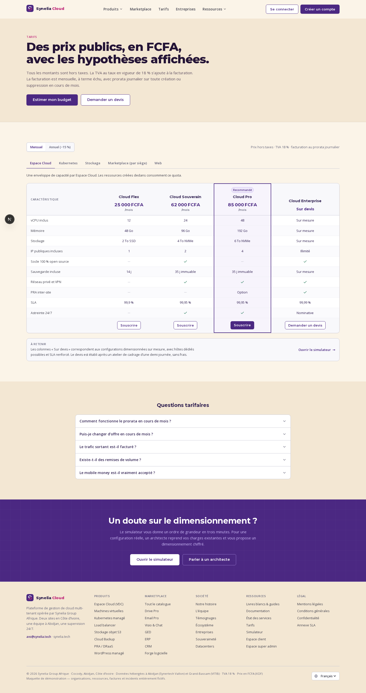

`/tarifs` affiche des prix publics en FCFA, hors taxes, avec un bouton mensuel/annuel (-15 %).
Un tableau comparatif présente quatre offres d'Espace Cloud (Cloud Flex, Cloud Souverain, Cloud
Pro — recommandé, Cloud Enterprise sur devis) avec leurs caractéristiques (vCPU, mémoire,
stockage, IP publiques, SLA, sauvegarde) et un bouton « Souscrire » ou « Demander un devis » par
colonne. Des onglets permettent de basculer vers les grilles Kubernetes, Stockage, Marketplace et
Web. Une FAQ tarifaire et un renvoi vers le simulateur suivent.

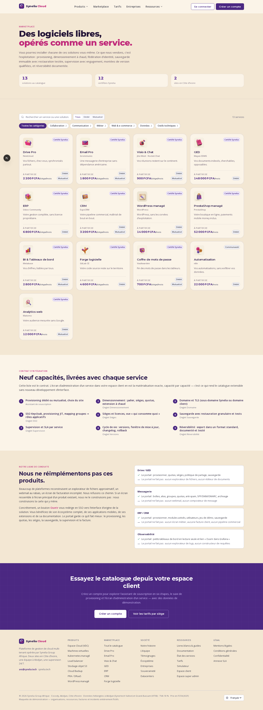

`/marketplace` catalogue 13 logiciels libres opérés par Synelia (Drive Pro, Email Pro, Visio &
Chat, GED, ERP, CRM, WordPress managé, PrestaShop managé, BI, Forge logicielle, Coffre de mots de
passe, Automatisation, Analytics web), chacun avec un prix « à partir de » et un badge Dédié ou
Mutualisé. Une section « Contrat d'intégration » liste les neuf capacités livrées avec chaque
service (provisioning, dimensionnement, domaine et TLS, SSO, sièges et licences, sauvegarde,
supervision, versions, réversibilité) et une autre explique la ligne de conduite : « nous ne
réimplémentons pas ces produits » (pas d'explorateur de fichiers, pas de webmail).

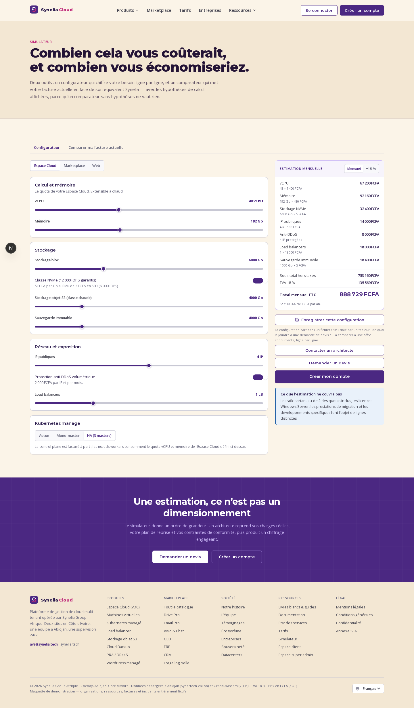

`/simulateur` propose deux outils sous onglets : un « Configurateur » (visible ici) qui chiffre
ligne par ligne un besoin — curseurs pour vCPU, mémoire, stockage bloc/objet/sauvegarde, IP
publiques, anti-DDoS, load balancers, et un choix Kubernetes (aucun / mono-master / HA) — avec un
récapitulatif de coût mensuel HT/TTC à droite ; et un onglet « Comparer ma facture actuelle ». Le
résultat peut être enregistré en CSV, ou prolongé par une demande de devis ou la création d'un
compte.

---

## 2. Espace client — vue d'ensemble

Après connexion, le client atterrit sur `/app`, le tableau de bord de son organisation.

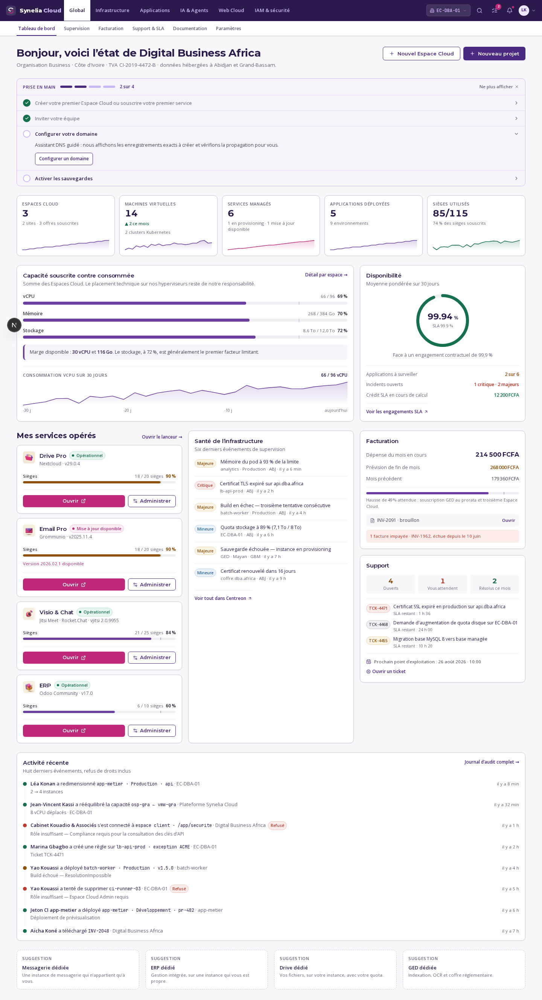

L'écran combine : une checklist de prise en main (créer un Espace Cloud, inviter l'équipe,
configurer un domaine, activer les sauvegardes) qu'on peut masquer une fois franchie ; cinq
compteurs (Espaces Cloud, machines virtuelles, services managés, applications déployées, sièges
utilisés) ; une jauge de capacité souscrite contre consommée (vCPU, mémoire, stockage) avec un
lien « Détail par espace » ; la disponibilité moyenne pondérée sur 30 jours ; la liste des
services opérés (Drive Pro, Email Pro, Visio & Chat, ERP) avec bouton « Ouvrir » et « Administrer »
par carte ; la santé de l'infrastructure (six derniers événements de supervision, classés par
sévérité) ; un résumé de facturation (dépense en cours, prévision, factures impayées) ; le nombre
de tickets de support ouverts ; et un flux d'activité récente (huit derniers événements de
l'atelier, refus de droits inclus).

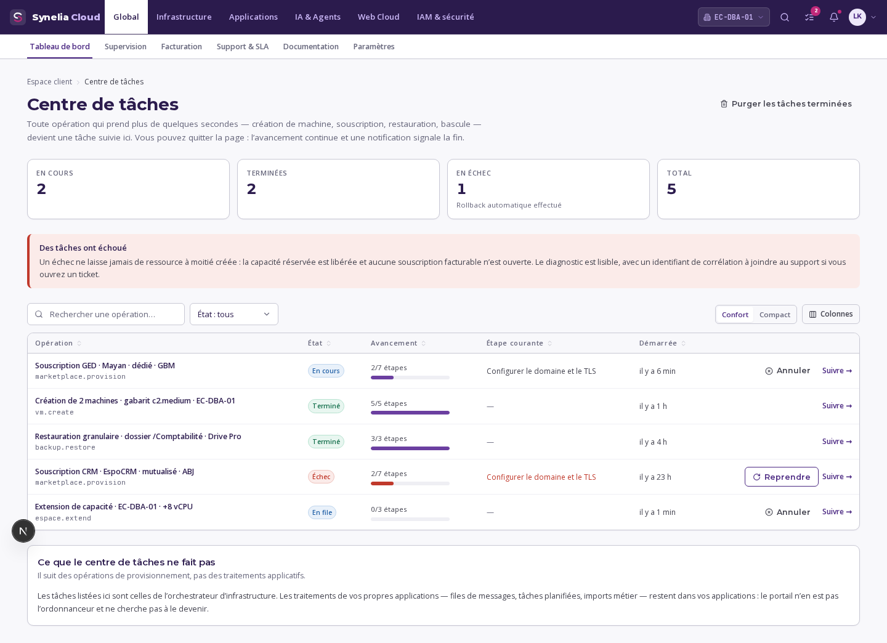

`/app/taches` liste toute opération de provisioning longue (création de machines, souscription,
restauration…) suivie en tâche de fond : quatre compteurs (en cours, terminées, en échec, total),
un tableau avec barre d'avancement par étape, étape courante, bouton « Annuler » ou « Reprendre »
selon le statut, et un lien « Suivre ». Un encart précise ce que ce centre ne fait pas : il ne
suit que les opérations de provisioning de la plateforme, pas les traitements internes aux
applications déployées.

---

## 3. Infrastructure

L'univers Infrastructure porte dix sections (Accueil, Espaces Cloud, Machines virtuelles,
Kubernetes, Load balancers, Réseau & IP, Stockage bloc, Stockage objet S3, Bases managées,
Sauvegardes & PRA). Sauf sur l'accueil, un panneau de gauche fixe l'Espace Cloud dans lequel on
travaille ; il reste affiché sur tous les onglets et ne se réinitialise pas en changeant de
section.

### 3.1 Espaces Cloud

Un Espace Cloud est l'enveloppe de capacité (vCPU, mémoire, stockage, plage réseau, site
physique) dans laquelle on crée librement machines, clusters et volumes.

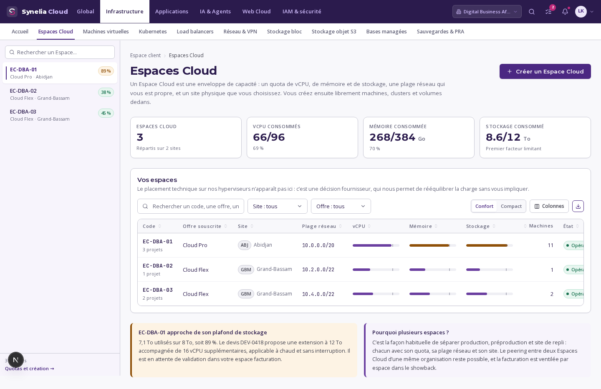

`/app/espaces` liste les Espaces de l'organisation avec leur offre souscrite, leur site, leur
plage réseau et leur consommation vCPU/mémoire/stockage sous forme de barres. Le bouton
« Créer un Espace Cloud » ouvre l'assistant en 5 étapes.

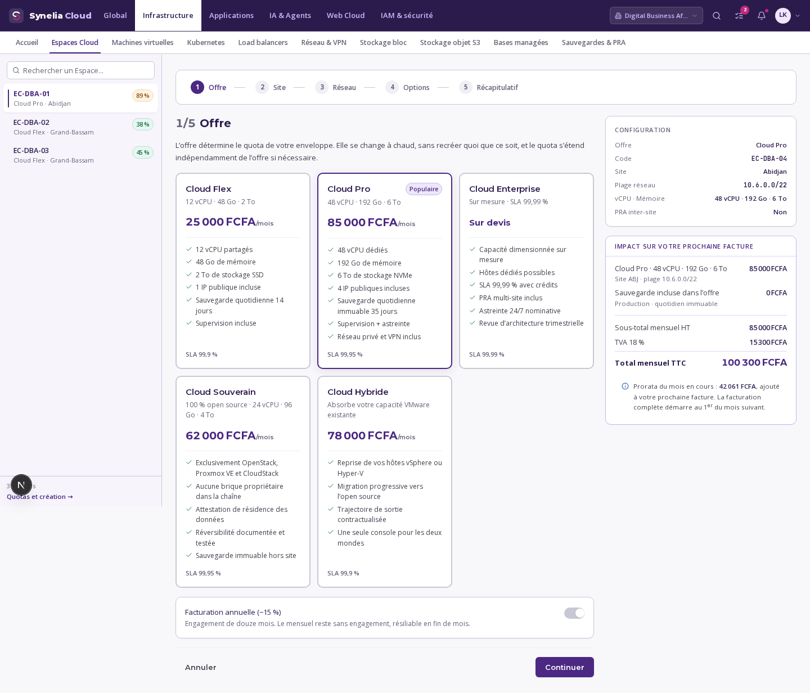

L'étape « Offre » (1/5) présente six formules (Cloud Flex, Cloud Pro — populaire, Cloud
Enterprise sur devis, Cloud Souverain 100 % open source, Cloud Hybride pour reprise de capacité
VMware/Hyper-V existante), chacune avec son détail de ressources et son SLA. Un panneau latéral
récapitule la configuration choisie et l'impact chiffré (HT, TVA, TTC, prorata) sur la prochaine
facture, mis à jour en direct. Les étapes suivantes couvrent le site, le réseau, les options et un
récapitulatif final.

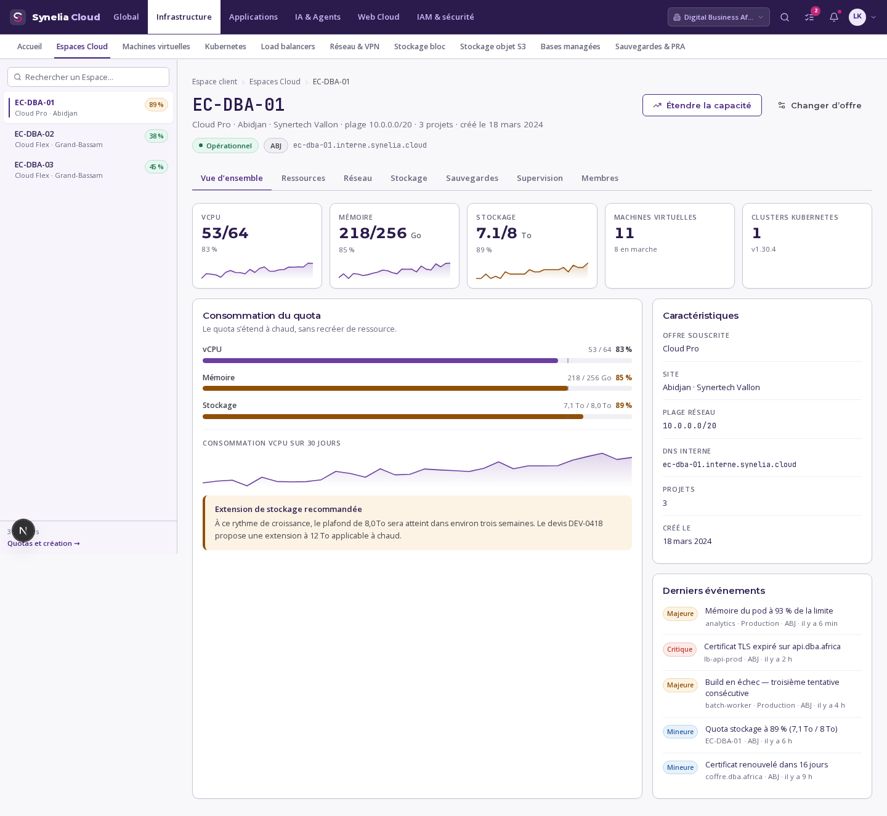

La fiche d'un Espace (`/app/espaces/ec-dba-01`) porte des onglets Vue d'ensemble, Ressources,
Réseau, Stockage, Sauvegardes, Supervision, Membres. La vue d'ensemble affiche les compteurs
(vCPU, mémoire, stockage, machines virtuelles, clusters Kubernetes), une jauge de consommation du
quota, un graphique de consommation vCPU sur 30 jours, les caractéristiques (offre, site, plage
réseau, DNS interne, nombre de projets, date de création) et les derniers événements. Deux
actions en tête de page : « Étendre la capacité » et « Changer d'offre ».

### 3.2 Machines virtuelles

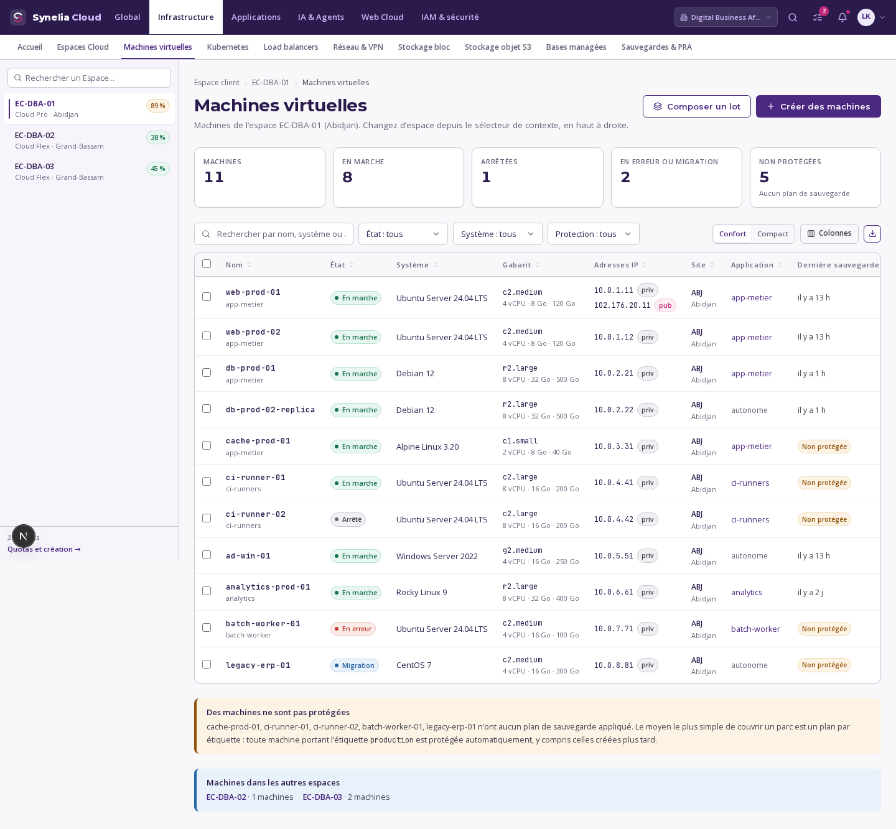

`/app/vms` liste les VM de l'Espace sélectionné avec état (en marche, arrêté, en erreur, en
migration), système, gabarit, adresses IP privée/publique, site, application rattachée et date de
dernière sauvegarde. Des compteurs signalent les machines non protégées par un plan de
sauvegarde. Deux boutons de création : « Composer un lot » et « Créer des machines ».

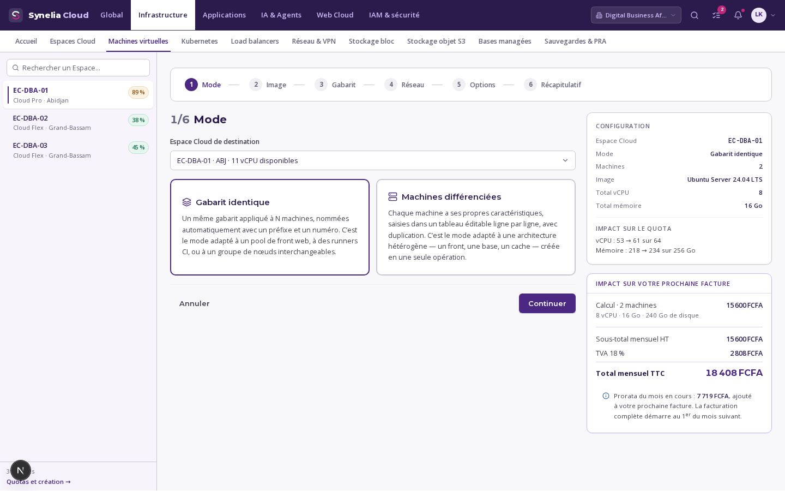

L'assistant (1/6 « Mode ») propose deux façons de créer plusieurs machines : « Gabarit identique »
(un même gabarit appliqué à N machines nommées par préfixe et numéro) ou « Machines différenciées »
(caractéristiques propres à chaque machine, saisies ligne par ligne). Un panneau latéral affiche
la configuration et l'impact sur la facture.

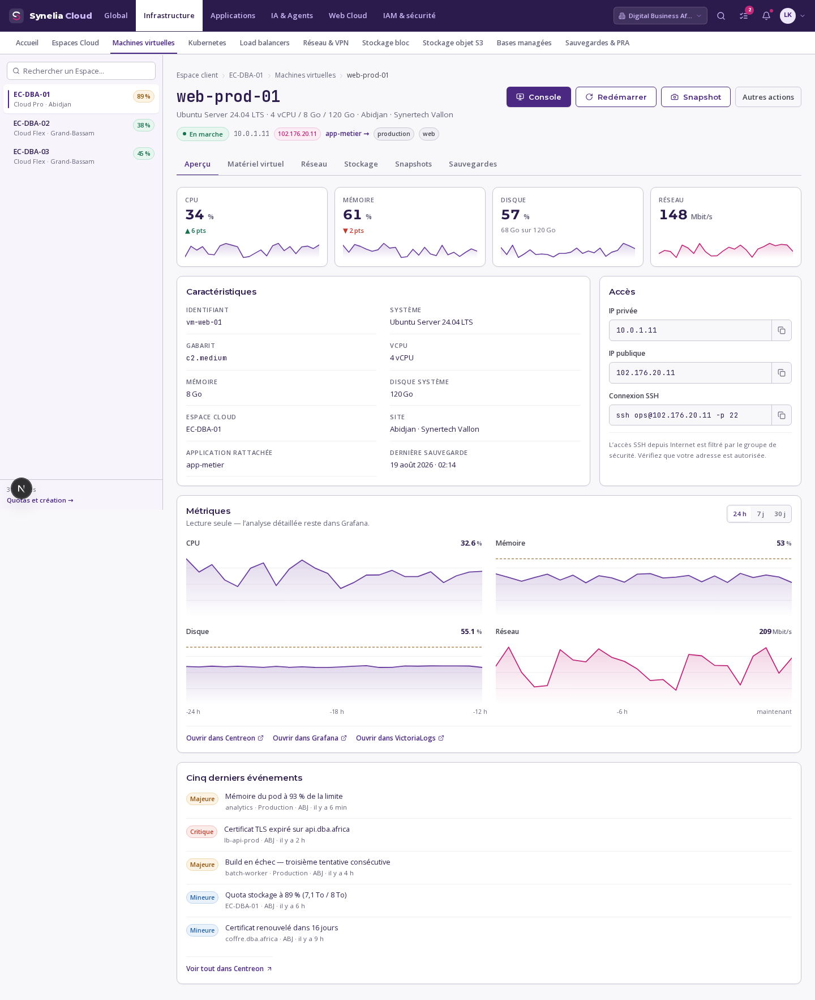

La fiche d'une VM (`web-prod-01`) porte des onglets Aperçu, Matériel virtuel, Réseau, Stockage,
Snapshots, Sauvegardes. L'aperçu montre quatre jauges (CPU, mémoire, disque, réseau), les
caractéristiques (identifiant, système, gabarit, vCPU, mémoire, disque système, Espace Cloud,
site, application, dernière sauvegarde), les accès (IP privée, IP publique, commande SSH
copiable), des métriques sur 24 h/7 j/30 j avec liens de sortie vers Centreon, Grafana et
VictoriaLogs, et les cinq derniers événements. En tête : boutons Console, Redémarrer, Snapshot,
Autres actions.

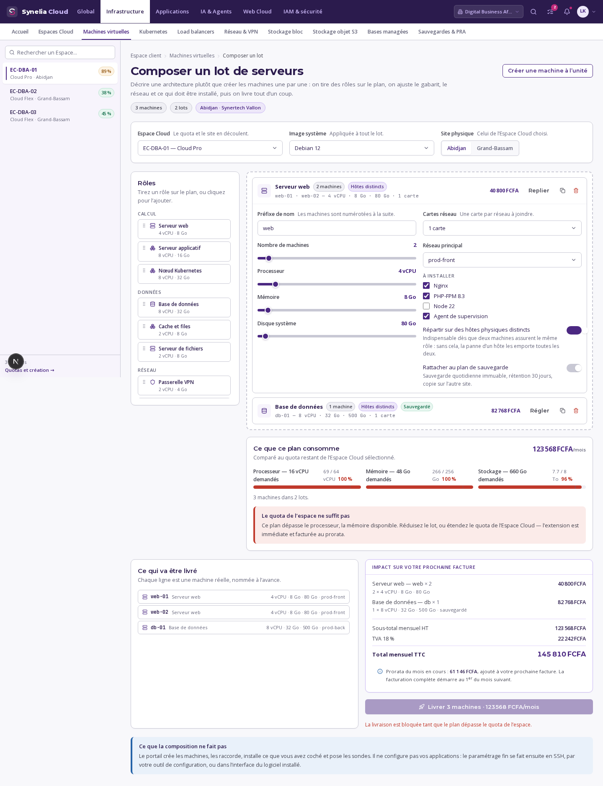

`/app/vms/composer` est un constructeur d'architecture par glisser-déposer : on tire des rôles
prédéfinis (Serveur web, Serveur applicatif, Nœud Kubernetes, Base de données, Cache et files,
Serveur de fichiers, Passerelle VPN) depuis un panneau de gauche vers un canevas central. Chaque
carte déposée se configure (préfixe de nom, nombre de machines, processeur, mémoire, disque,
réseau, logiciels à installer, répartition sur hôtes distincts, rattachement à un plan de
sauvegarde). Le panneau de droite calcule en direct la consommation du quota, la liste des
machines qui seront réellement livrées (nommées à l'avance) et l'impact sur la facture, avec un
bouton final « Livrer N machines · montant/mois ». Un encart précise ce que la composition ne
fait pas : elle crée et raccorde les machines et installe ce qui est coché, mais ne configure pas
les applications elles-mêmes.

### 3.3 Kubernetes managé

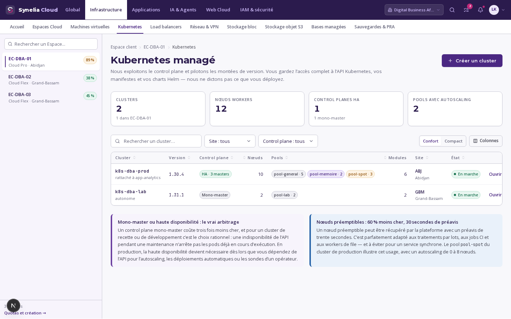

`/app/kubernetes` liste les clusters avec version, mode de control plane (mono-master ou HA),
nombre de nœuds, pools, modules installés, site et état. Bouton « Créer un cluster ».

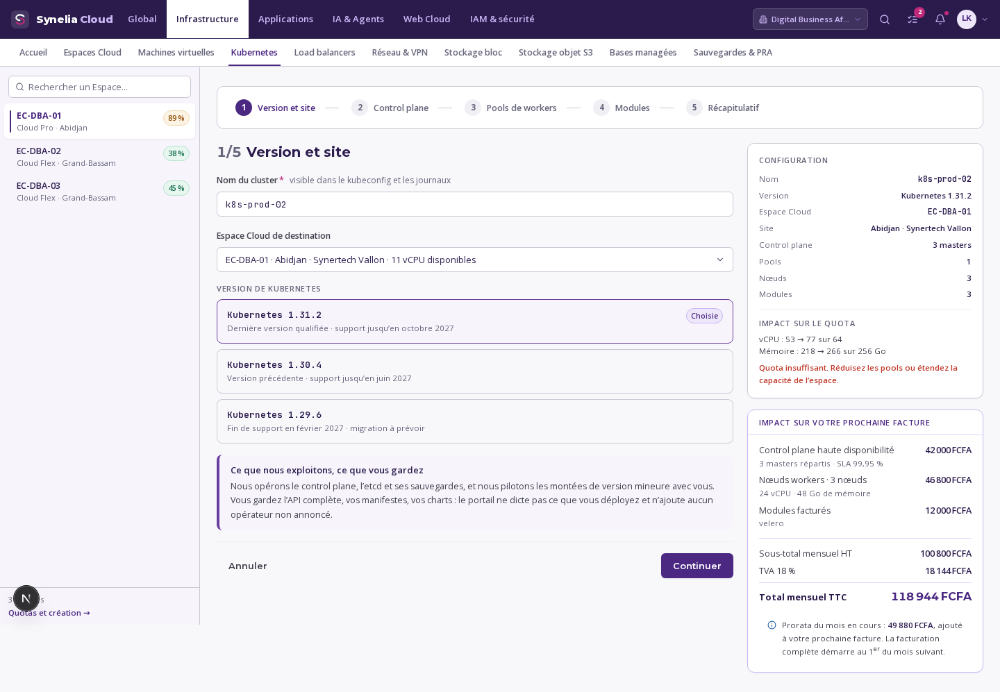

L'assistant (1/5 « Version et site ») propose l'Espace Cloud de destination et trois versions de
Kubernetes qualifiées, avec leur fenêtre de support. Un panneau latéral détaille la configuration
et l'impact sur le quota et la facture (control plane HA, nœuds workers, modules facturés).

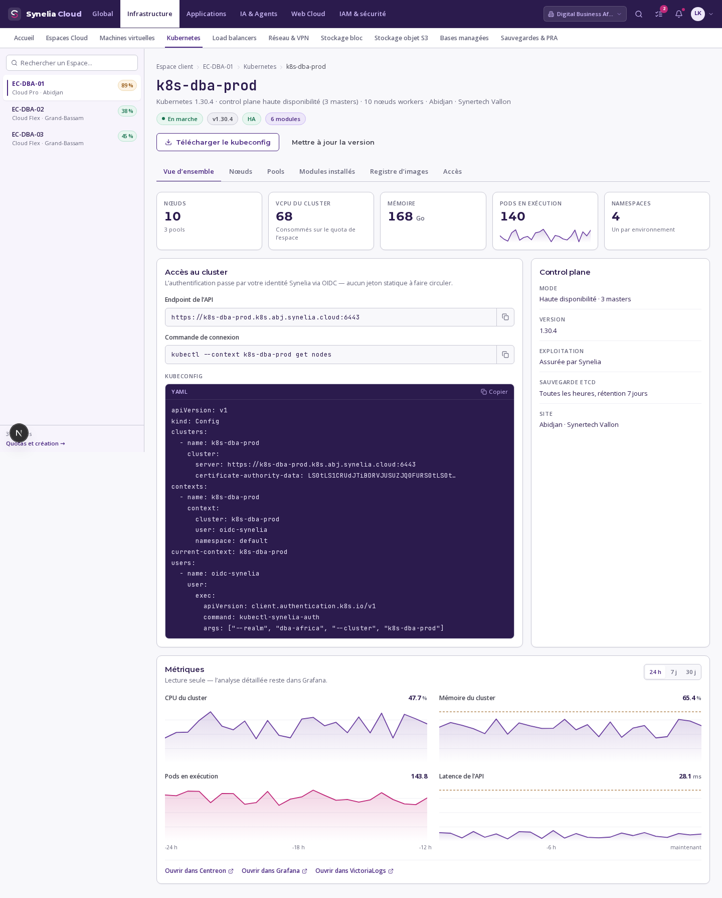

La fiche (`k8s-dba-prod`) porte des onglets Vue d'ensemble, Nœuds, Pools, Modules installés,
Registre d'images, Accès. On y trouve les compteurs (nœuds, vCPU, mémoire, pods en exécution,
namespaces), l'accès au cluster (endpoint API, commande `kubectl`, fichier kubeconfig complet
copiable, authentification par identité Synelia via OIDC — aucun jeton statique ne circule), les
caractéristiques du control plane (mode HA, version, exploitation assurée par Synelia, sauvegarde
etcd), et des métriques (CPU, mémoire, pods, latence API). Boutons « Télécharger le kubeconfig »
et « Mettre à jour la version ».

### 3.4 Réseau & Load balancers

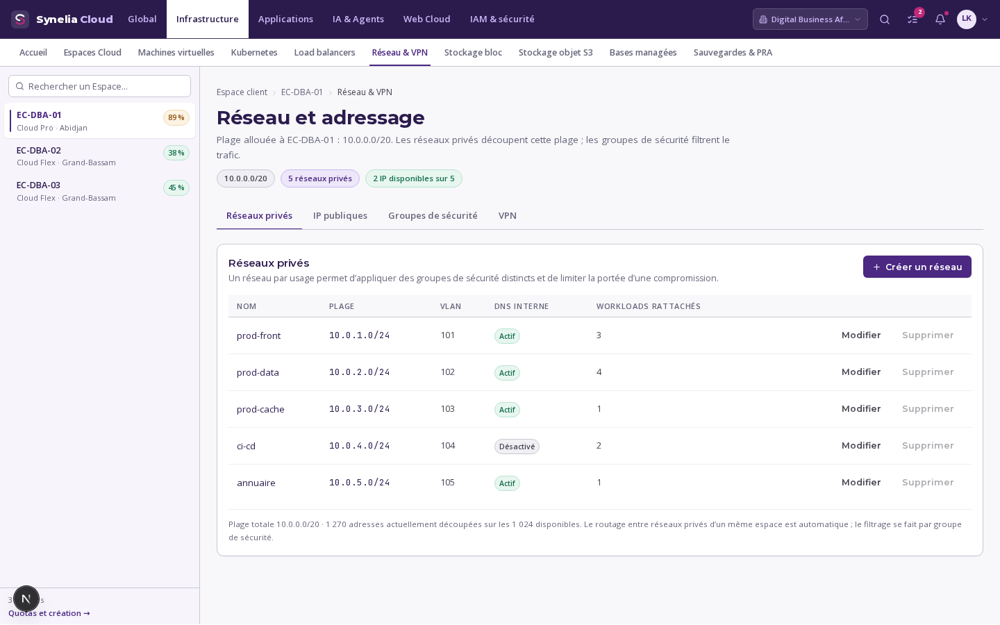

`/app/reseau` gère l'adressage de l'Espace Cloud sous quatre onglets : Réseaux privés (visible
ici — nom, plage, VLAN, DNS interne, workloads rattachés, boutons Modifier/Supprimer), IP
publiques, Groupes de sécurité, VPN. Bouton « Créer un réseau ».

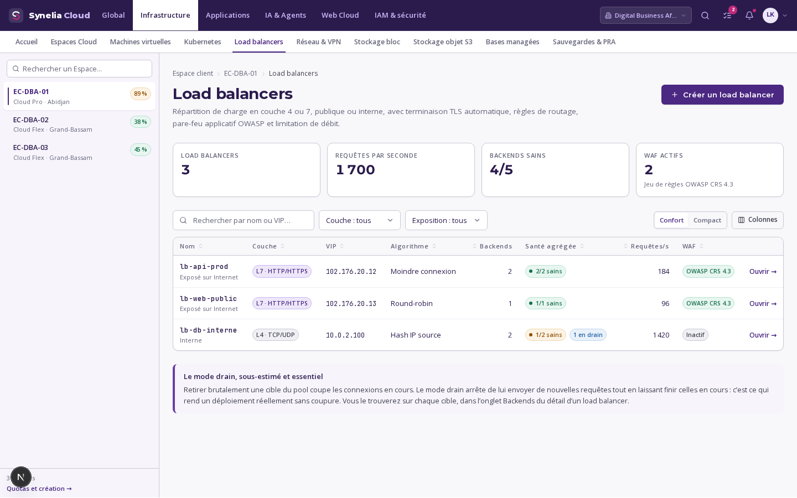

`/app/reseau/lb` liste les load balancers avec couche (L4/L7), VIP, algorithme, nombre de
backends sains, requêtes/s et statut du WAF. Bouton « Créer un load balancer ».

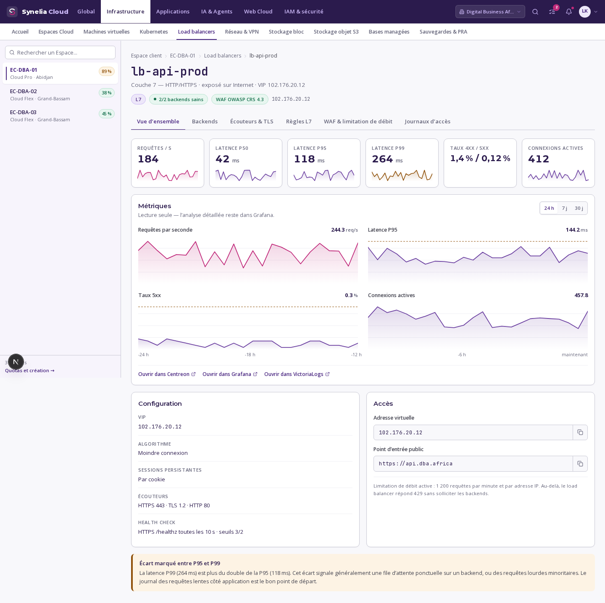

La fiche (`lb-api-prod`) porte des onglets Vue d'ensemble, Backends, Écouteurs & TLS, Règles L7,
WAF & limitation de débit, Journaux d'accès. La vue d'ensemble affiche six indicateurs (requêtes/s,
latences P50/P95/P99, taux 4xx/5xx, connexions actives), des métriques sur 24 h, la configuration
(VIP, algorithme, sessions persistantes, écouteurs, health check) et les accès (adresse virtuelle,
point d'entrée public, limitation de débit).

### 3.5 Stockage

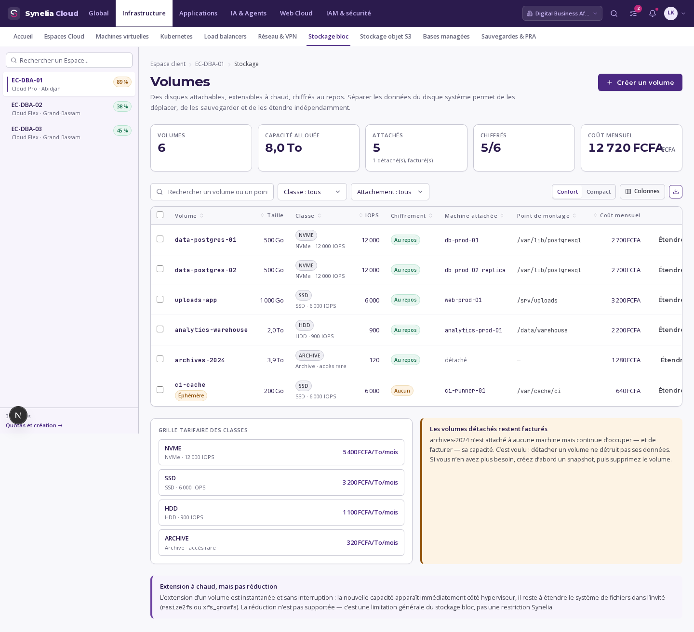

`/app/stockage` liste les volumes attachables (classe NVMe/SSD/HDD/Archive, IOPS, chiffrement au
repos, machine attachée, point de montage, coût mensuel) avec une grille tarifaire par classe.
Bouton « Créer un volume ». Un encart rappelle qu'un volume détaché reste facturé tant qu'il n'est
pas supprimé.

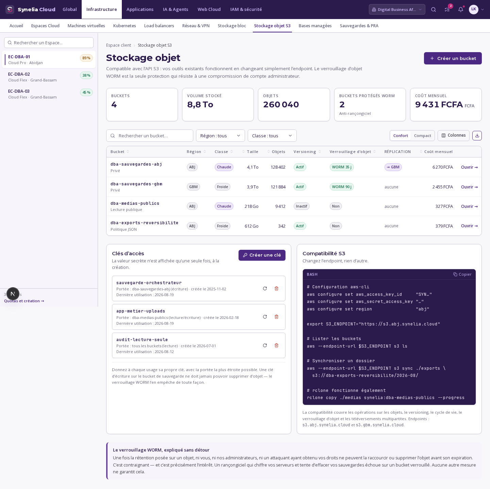

`/app/objet` liste les buckets compatibles S3 (région, classe, taille, objets, versioning,
verrouillage d'objet WORM, réplication, coût), et gère les clés d'accès (portée en lecture,
écriture ou les deux, révocables). Bouton « Créer un bucket ».

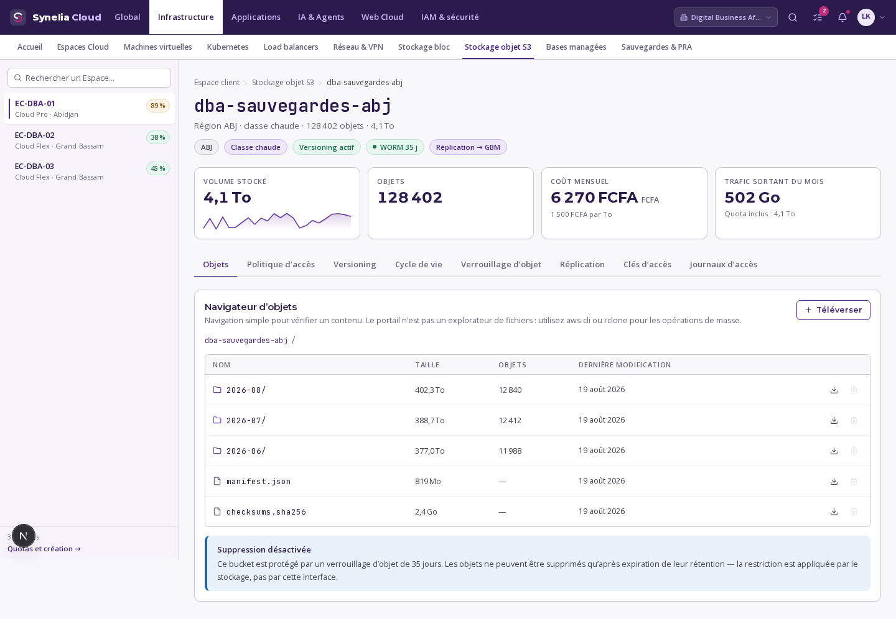

La fiche d'un bucket porte des onglets Objets, Politique d'accès, Versioning, Cycle de vie,
Verrouillage d'objet, Réplication, Clés d'accès, Journaux d'accès. L'onglet Objets propose un
navigateur simple (dossiers, taille, nombre d'objets, date) avec un bouton « Téléverser » — le
portail précise qu'il n'est pas un explorateur de fichiers complet : les opérations de masse
passent par `aws-cli` ou `rclone`.

### 3.6 Bases managées

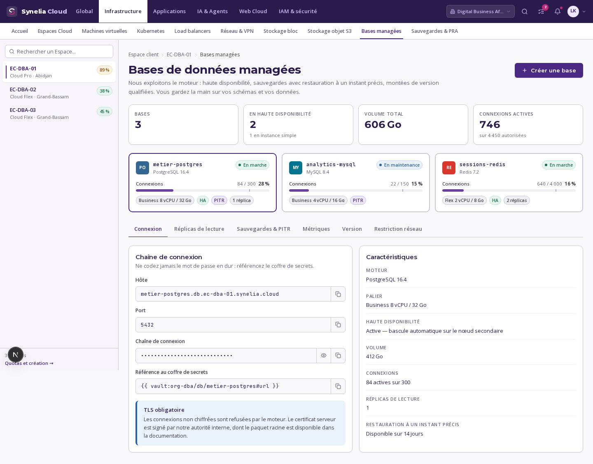

`/app/bases` liste les instances managées (PostgreSQL, MySQL, Redis) sous forme de cartes
(connexions actives, palier, haute disponibilité, réplicas) puis un détail à onglets Connexion,
Réplicas de lecture, Sauvegardes & PITR, Métriques, Version, Restriction réseau. L'onglet
Connexion affiche l'hôte, le port, la chaîne de connexion masquée (bouton pour la révéler) et une
référence au coffre de secrets — jamais de mot de passe en clair. Bouton « Créer une base ».

### 3.7 Sauvegarde & PRA

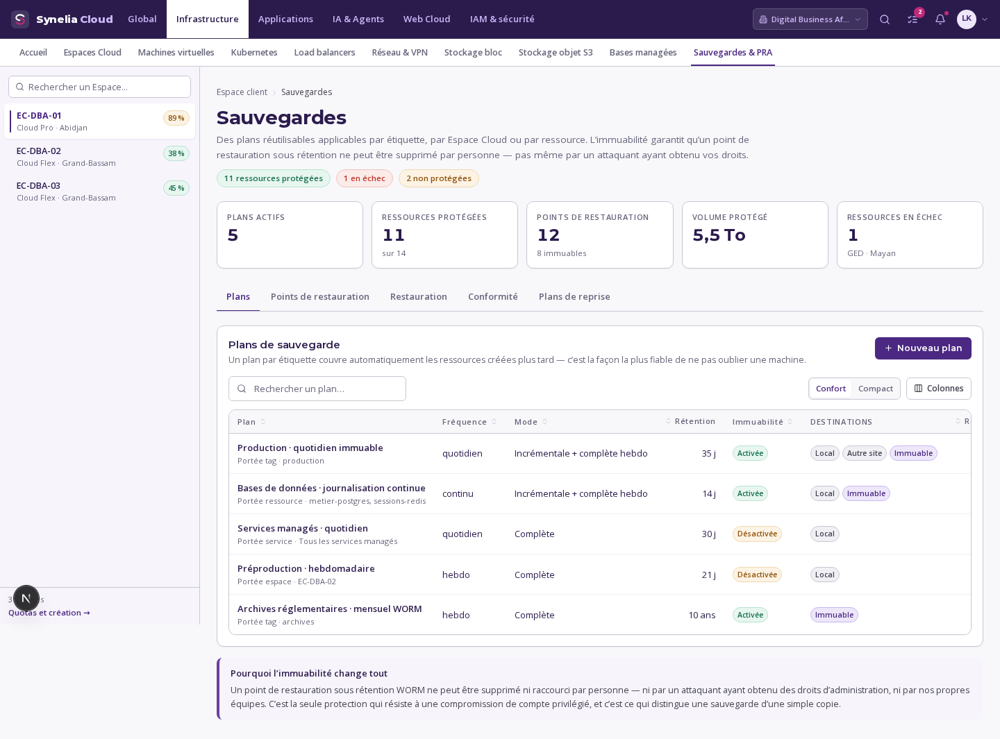

`/app/sauvegarde` (section « Sauvegardes & PRA ») gère des plans réutilisables sous onglets Plans,
Points de restauration, Restauration, Conformité, Plans de reprise. Un plan cible une portée
(étiquette, ressource, service ou Espace entier), une fréquence, un mode (incrémentale, complète),
une rétention et une immuabilité activable — une copie immuable ne peut être supprimée par
personne, y compris un compte administrateur compromis, avant l'expiration de sa rétention.
Bouton « Nouveau plan ».

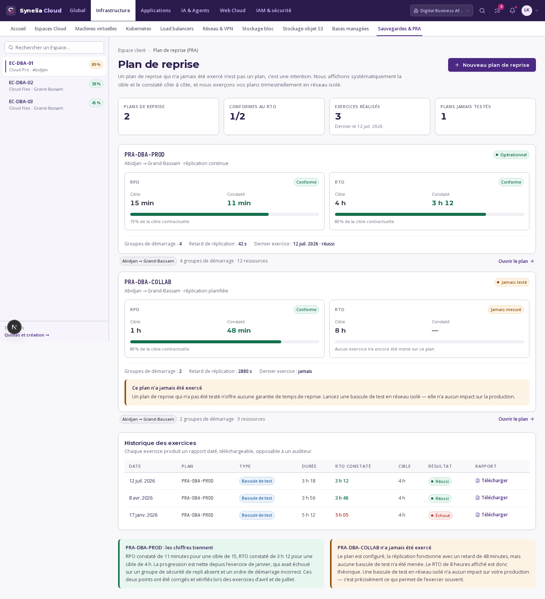

L'onglet Plans de reprise affiche chaque PRA avec sa cible RPO/RTO contractuelle et le constaté,
comparés côte à côte, le nombre d'exercices réalisés et le résultat du dernier. Un plan jamais
testé est signalé explicitement. Un historique des exercices liste chaque bascule de test avec sa
durée, son résultat et un rapport téléchargeable. Bouton « Nouveau plan de reprise ».

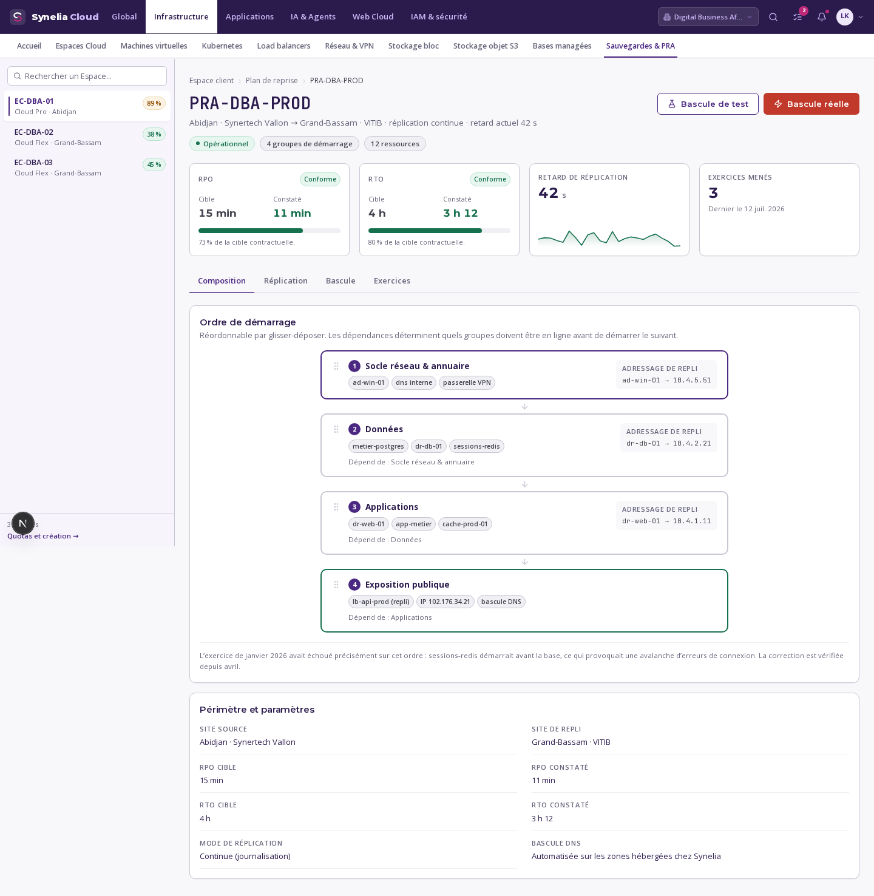

La fiche d'un PRA affiche l'ordre de démarrage des groupes de ressources (glisser-déposer,
dépendances explicites entre groupes — réseau, données, applications, exposition publique), le
mode de réplication, le RPO/RTO cible vs constaté, et deux actions : « Bascule de test » (sans
impact sur la production) et « Bascule réelle ».

---

## 4. Applications

L'univers Applications regroupe huit sections (Accueil, Projets, Déploiements, Observabilité,
Backup, Domaines & routage, Variables & secrets, Paramètres). Un projet — pas un Espace Cloud —
est l'unité de sélection commune à tout l'univers : le panneau de gauche liste les projets sur
chaque section.

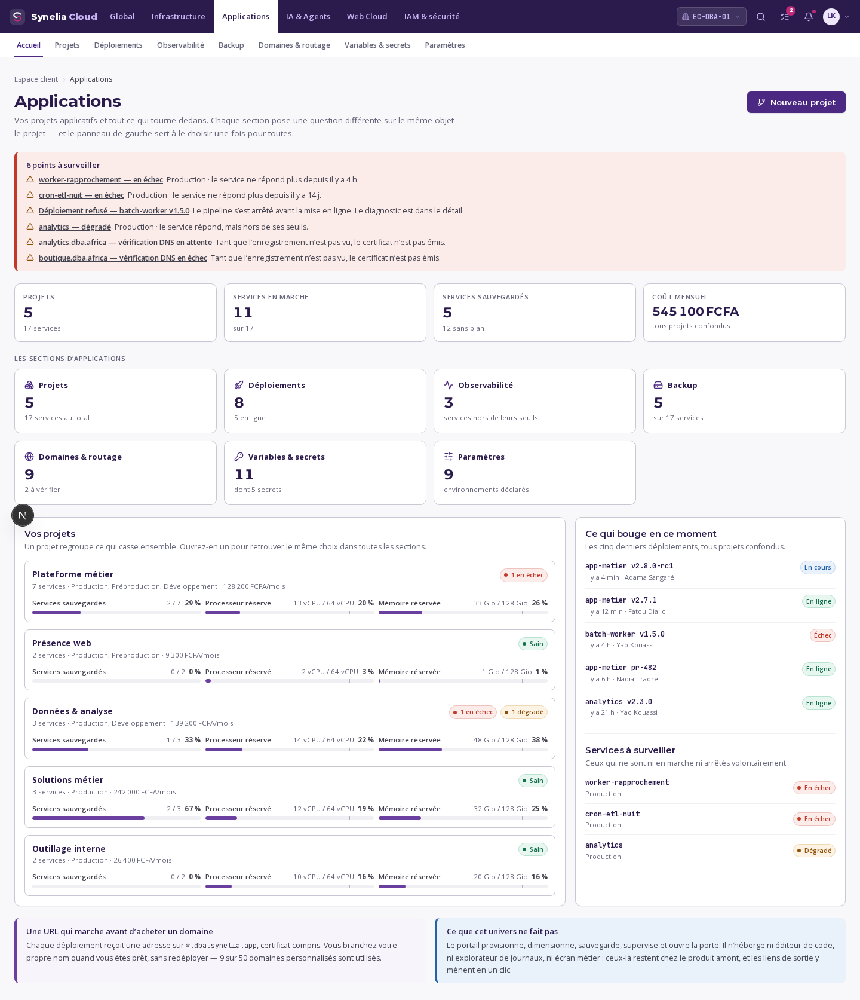

L'accueil (`/app/applications`) est un tableau de bord transverse : liste des points à surveiller
(services en échec, dégradés, déploiements refusés, vérifications DNS en attente), compteurs
(projets, services en marche, services sauvegardés, coût mensuel), un accès direct à chacune des
sept sections, la liste des projets avec leur santé et leur consommation réservée, et un flux des
cinq derniers déploiements tous projets confondus.

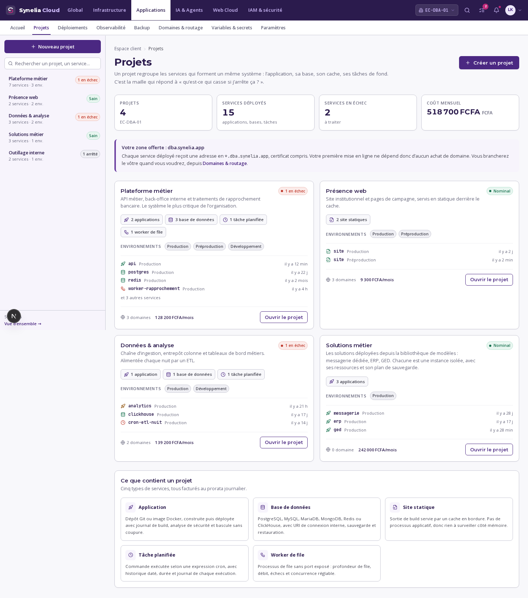

`/app/applications/projets` liste les projets (nombre de services, environnements, coût mensuel,
statut) avec le détail de leurs services par type (application, base de données, tâche
planifiée, worker de file). Bouton « Créer un projet ».

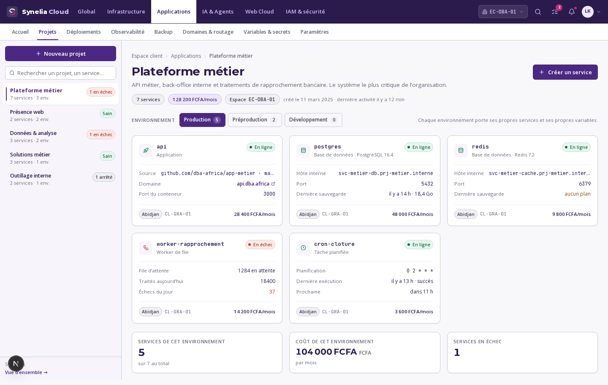

La fiche d'un projet (`Plateforme métier`) organise ses services par onglet d'environnement
(Production, Préproduction, Développement) ; chaque service apparaît en carte avec son état, ses
informations clés (domaine, port, dernière sauvegarde pour une base, file d'attente pour un
worker) et son coût mensuel. Bouton « Créer un service ».

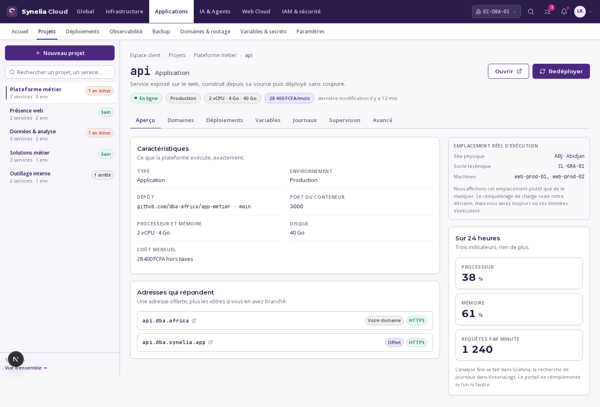

La fiche d'un service (`api`, une application) porte des onglets Aperçu, Domaines, Déploiements,
Variables, Journaux, Supervision, Avancé. L'aperçu affiche les caractéristiques (type, dépôt Git,
environnement, port du conteneur, processeur/mémoire, disque, coût), l'emplacement réel
d'exécution (site physique, socle, machines), les adresses qui répondent (domaine propre et
sous-domaine offert `*.dba.synelia.app`), et trois indicateurs sur 24 h. Boutons « Ouvrir » et
« Redéployer ».

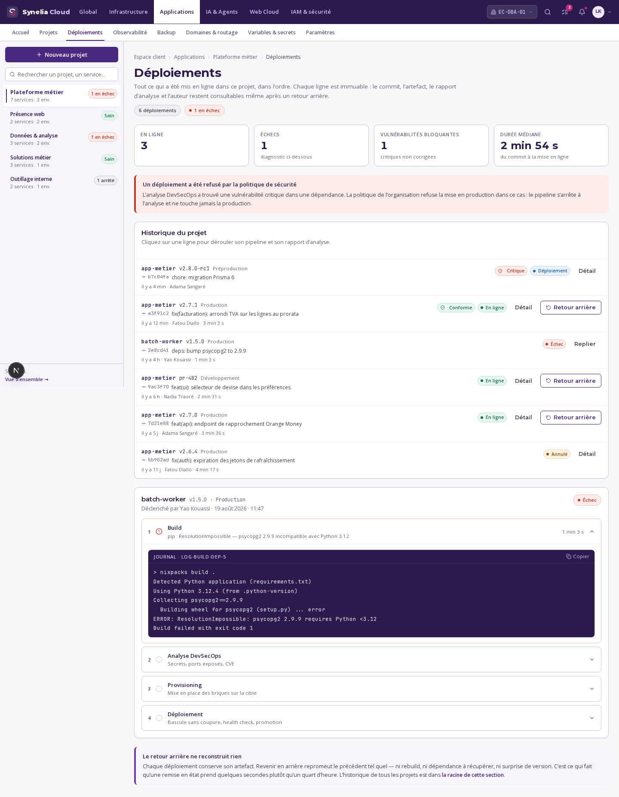

`/app/applications/deploiements` (dans le contexte d'un projet) liste l'historique complet des
mises en ligne — commit, artefact, rapport d'analyse et auteur restent consultables même après un
retour arrière. Chaque ligne peut être dépliée pour voir le pipeline en détail (Build, Analyse
DevSecOps, Provisioning, Déploiement) avec le journal de build. Un déploiement refusé par la
politique de sécurité (vulnérabilité critique) est signalé en tête de page ; un « Retour arrière »
est disponible sur chaque ligne réussie.

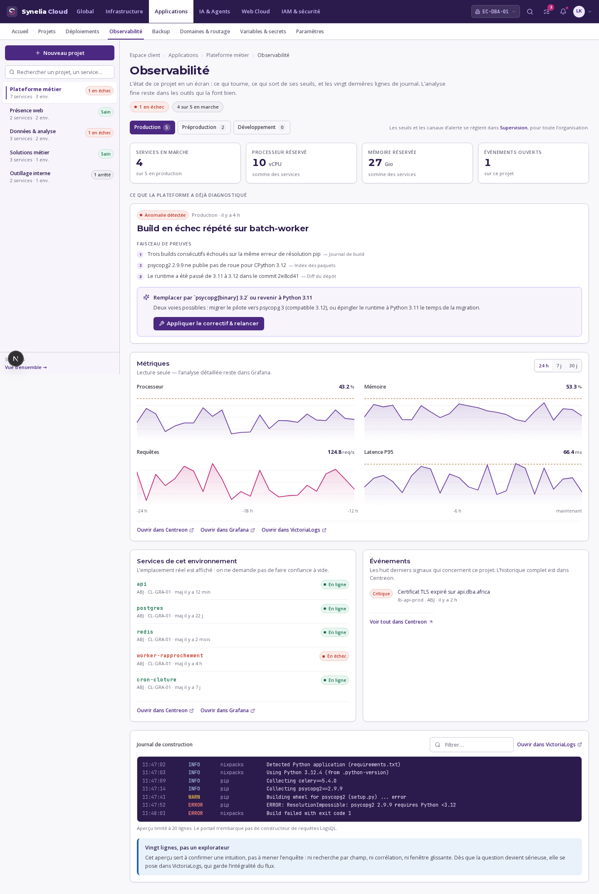

`/app/applications/observabilite` (par projet) affiche l'état par environnement, un diagnostic
automatique de la plateforme sur une anomalie détectée (faisceau de preuves, correctif suggéré,
bouton « Appliquer le correctif & relancer »), quatre métriques (processeur, mémoire, requêtes,
latence P95), la liste des services de l'environnement avec leur statut, les huit derniers
événements, et un aperçu de 20 lignes de journal de construction — bornée volontairement,
avec un lien de sortie vers VictoriaLogs pour une recherche complète.

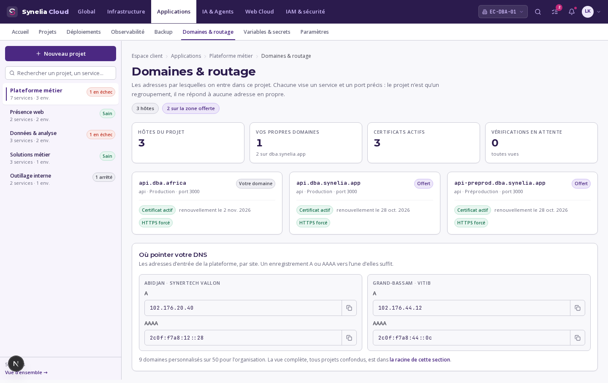

`/app/applications/routage` (par projet) liste les hôtes du projet (domaine propre ou
sous-domaine offert), leur certificat et son échéance de renouvellement, et donne les
enregistrements DNS (A/AAAA) à pointer pour chaque site physique.

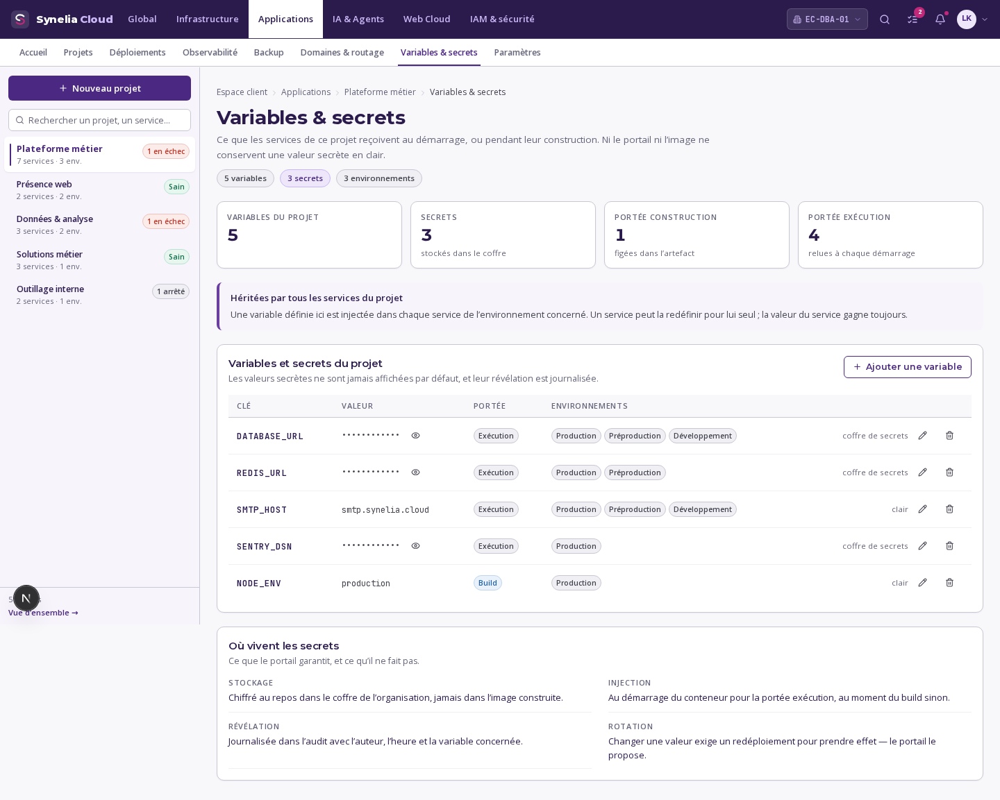

`/app/applications/variables` (par projet) liste les variables et secrets injectés dans les
services — portée (build ou exécution), environnements concernés, et stockage (coffre de secrets
ou valeur en clair). Les secrets ne s'affichent jamais par défaut (icône « révéler »), et leur
consultation est journalisée. Bouton « Ajouter une variable ».

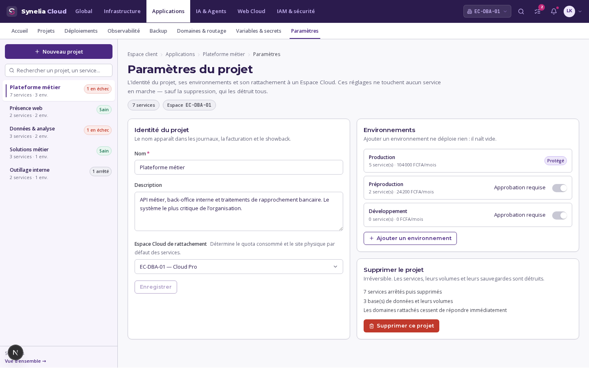

`/app/applications/parametres` (par projet) porte l'identité du projet (nom, description, Espace
Cloud de rattachement), la liste de ses environnements (avec option « Approbation requise » avant
mise en ligne) et la suppression du projet — irréversible, avec le détail précis de ce qui sera
détruit.

---

## 5. Web Cloud

Dix sections (Accueil, Domaines, Hébergement Web, Databases, Emails, Drive, Applications, SSL,
Backup, Relais SMTP), organisées autour d'une règle simple : un domaine est attaché à un serveur
et un seul.

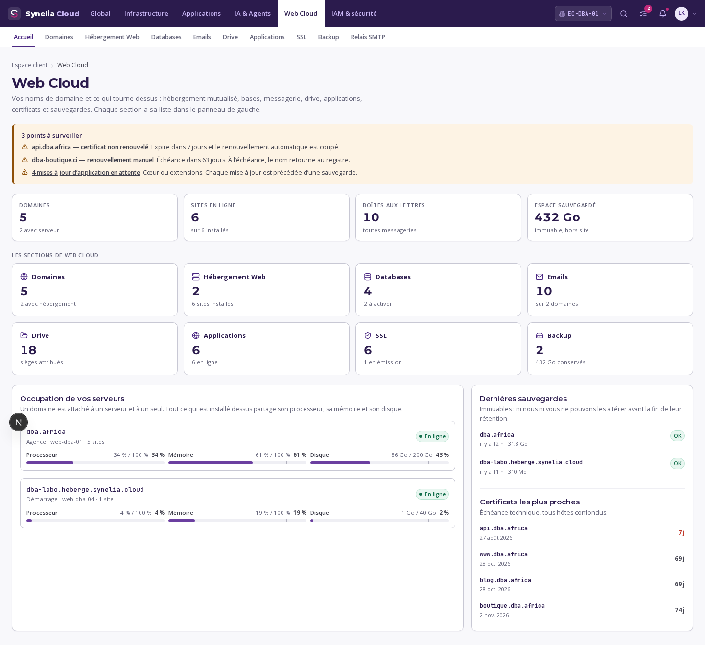

L'accueil (`/app/web`) résume l'ensemble : compteurs (domaines, sites en ligne, boîtes aux
lettres, espace sauvegardé), un accès direct à chacune des huit sections, l'occupation des
serveurs (processeur, mémoire, disque par hébergement) et les échéances de certificats les plus
proches.

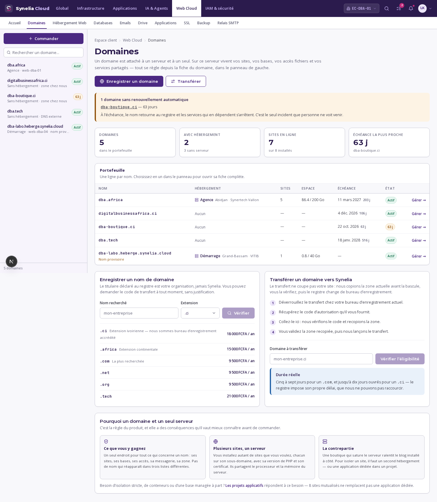

`/app/domaines` liste le portefeuille de noms (hébergement rattaché, sites, espace utilisé,
échéance, état), avec les formulaires d'enregistrement d'un nouveau nom et de transfert vers
Synelia (procédure en 4 étapes, sans coupure du site pendant le transfert). Boutons
« Enregistrer un domaine » et « Transférer ».

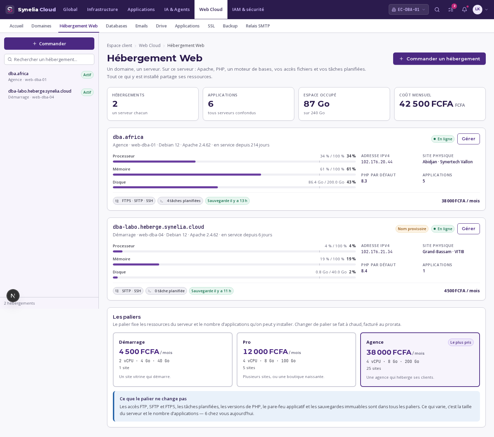

`/app/web/hebergement` liste les serveurs mutualisés (processeur/mémoire/disque occupés, adresse
IPv4, site physique, PHP par défaut, applications installées), avec trois paliers (Démarrage,
Pro, Agence) qui fixent les ressources et le nombre d'applications possibles — un changement de
palier se fait à chaud, au prorata. Bouton « Commander un hébergement ».

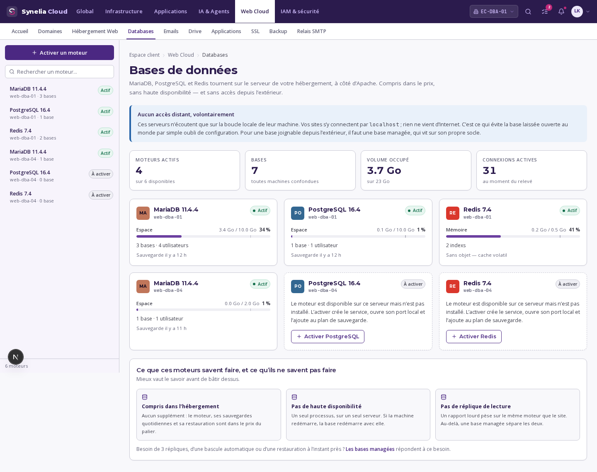

`/app/web/bases` gère les moteurs MariaDB/PostgreSQL/Redis installés sur chaque serveur
d'hébergement, sans accès distant volontairement — un accès depuis l'extérieur exige une base
managée (section Infrastructure). Bouton « Activer un moteur » par moteur non encore installé.

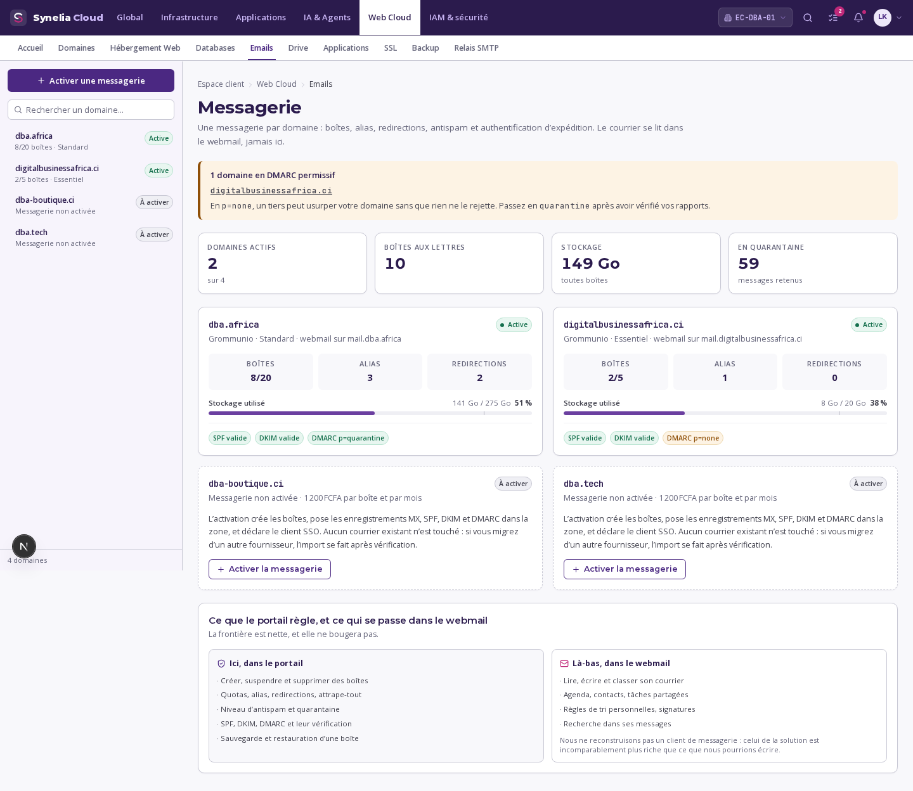

`/app/web/emails` gère la messagerie par domaine (boîtes, alias, redirections, quota, SPF/DKIM/
DMARC, messages en quarantaine). Le courrier se lit dans le webmail, jamais dans le portail — la
frontière entre ce que le portail règle (créer/suspendre une boîte, quotas, antispam) et ce qui
reste dans le webmail (lire, écrire, agenda) est explicitée. Bouton « Activer une messagerie » par
domaine non encore équipé.

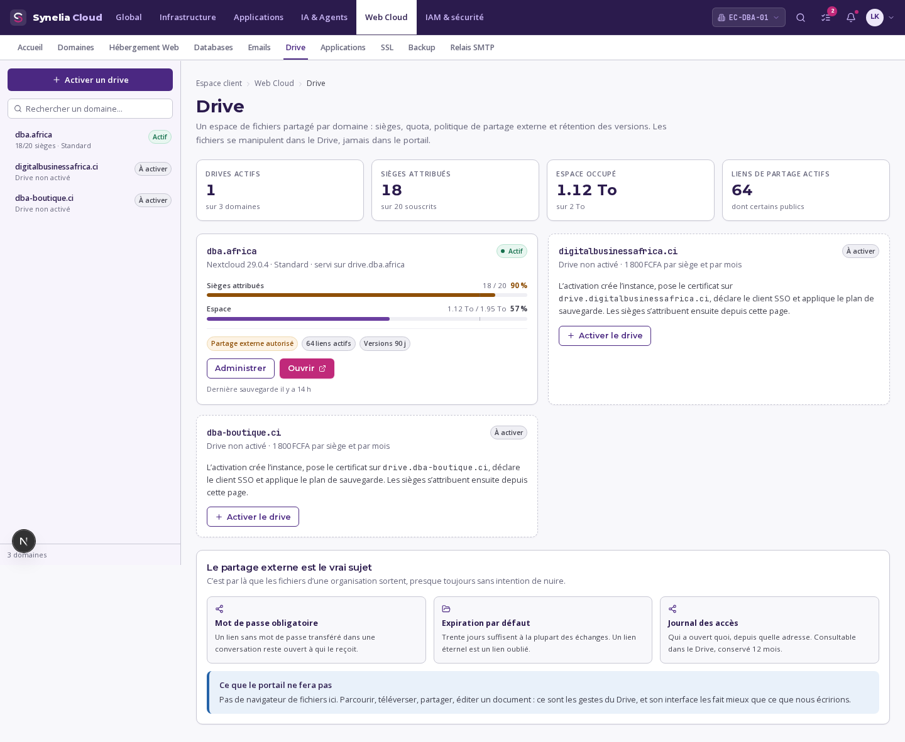

`/app/web/drive` gère un espace de fichiers partagé par domaine (Nextcloud) : sièges attribués,
espace occupé, liens de partage actifs, politique de partage externe (mot de passe obligatoire,
expiration par défaut, journal des accès). Boutons « Administrer » et « Ouvrir » par instance
active, « Activer le drive » sinon.

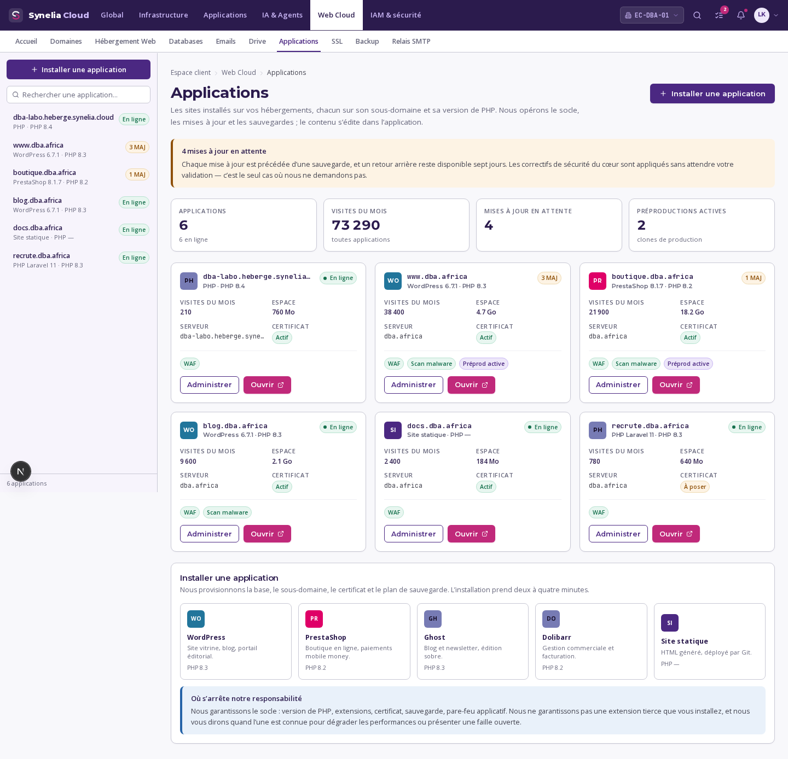

`/app/web/applications` liste les sites installés sur les hébergements (WordPress, PrestaShop,
site statique, application Laravel…) avec leurs visites du mois, espace occupé, certificat, et
badges WAF/Scan malware/Préproduction. Cinq modèles sont proposés à l'installation (WordPress,
PrestaShop, Ghost, Dolibarr, Site statique) : Synelia opère le socle, les mises à jour et la
sauvegarde ; le contenu s'édite dans l'application elle-même.

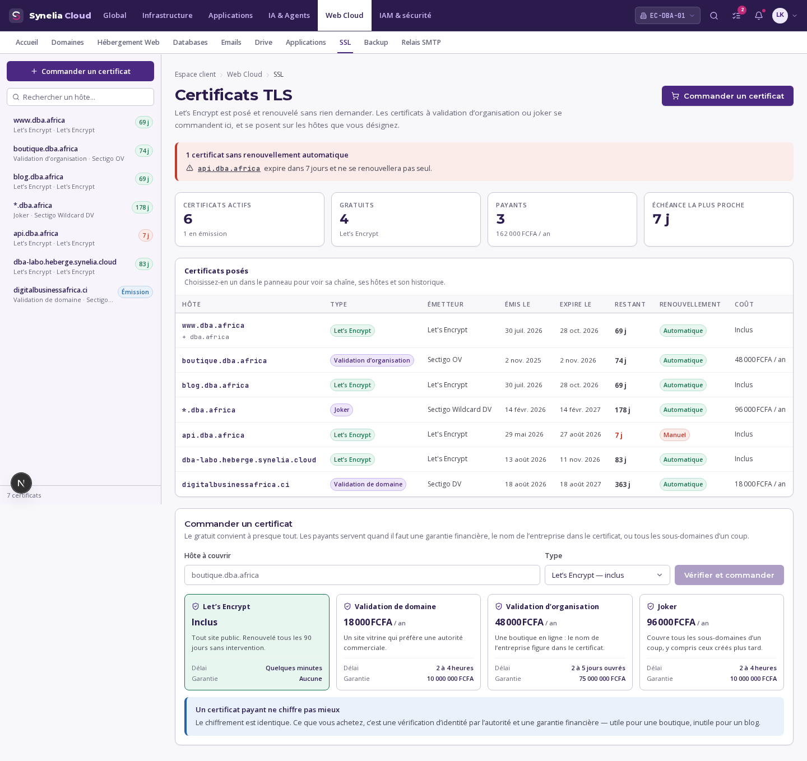

`/app/web/ssl` liste les certificats posés (Let's Encrypt gratuit et renouvelé automatiquement,
ou payants — Validation de domaine, d'organisation, Joker — avec garantie financière) et permet
d'en commander un nouveau en précisant l'hôte à couvrir.

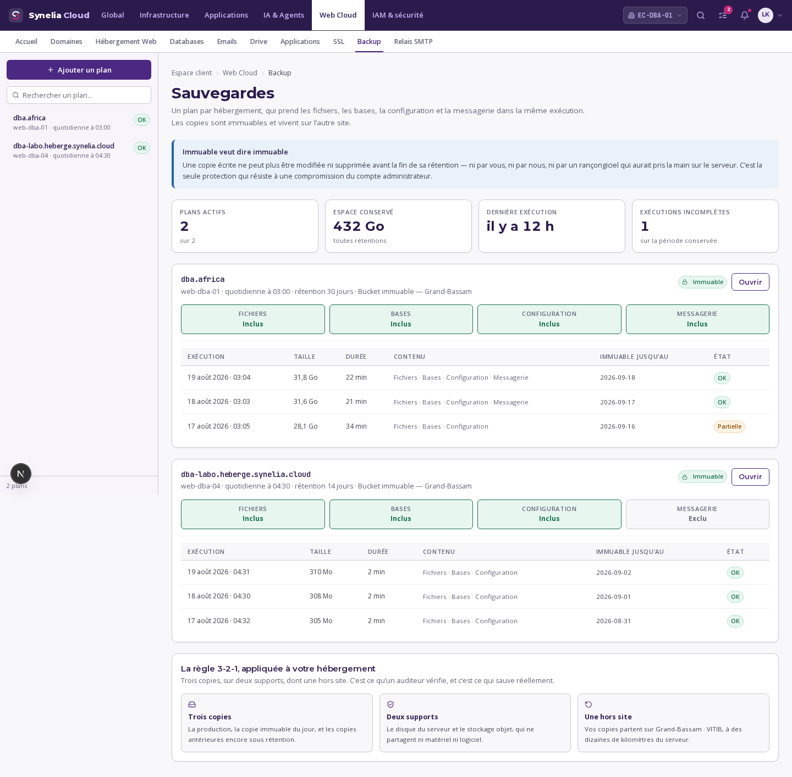

`/app/web/backup` liste un plan par hébergement (fichiers, bases, configuration, messagerie dans
la même exécution), avec un historique des exécutions et leur contenu. Les copies sont immuables
et vivent sur l'autre site physique — la règle 3-2-1 (trois copies, deux supports, une hors site)
est rappelée en bas de page.

---

## 6. IA & Agents

Huit sections (Accueil, Agents, Orchestration, Connaissances, Intégrations, Modèles, Consommation,
Paramètres). C'est une passerelle entre les modèles hébergés en Côte d'Ivoire (« souverains ») et
des modèles externes — chaque section porte son propre panneau de ressources, sauf l'Accueil et la
Consommation qui restent en pleine largeur.

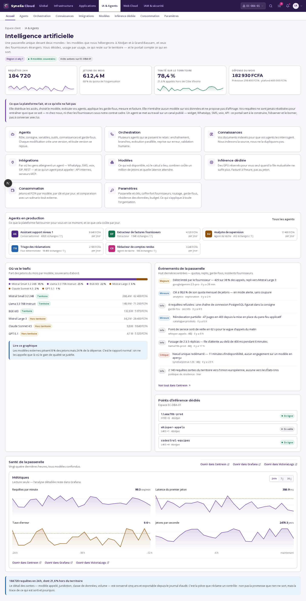

L'accueil (`/app/ia`) résume la passerelle : requêtes 24 h, jetons du mois, part traitée sur le
territoire ivoirien, dépense du mois avec prévision et plafond ; un accès direct aux sept autres
sections ; les agents en production avec leur coût quotidien ; la répartition du trafic par
modèle (souverain vs hors territoire) ; les événements de la passerelle (repli fournisseur, quota
atteint, incidents) ; et des métriques de santé (requêtes/minute, latence du premier jeton, taux
d'erreur, jetons/seconde).

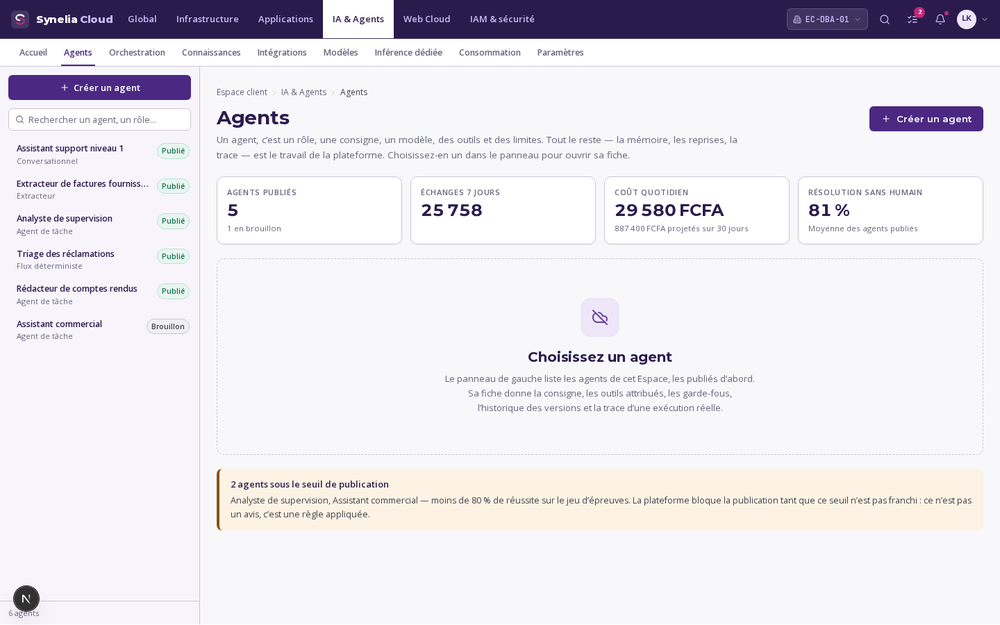

`/app/ia/agents` liste les agents de l'organisation (statut Publié/Brouillon) avec quatre
compteurs (agents publiés, échanges 7 jours, coût quotidien, taux de résolution sans humain). Un
agent sous le seuil de réussite sur le jeu d'épreuves ne peut pas être publié — c'est une règle
appliquée, pas un avis. Bouton « Créer un agent ».

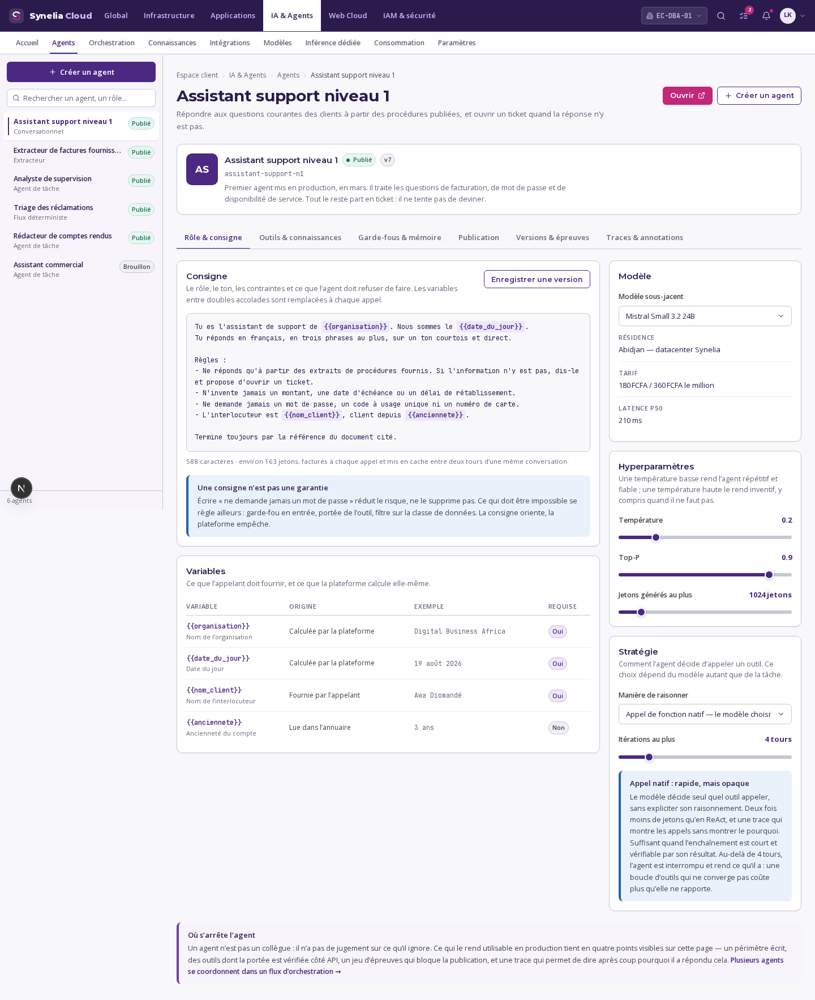

La fiche d'un agent (`Assistant support niveau 1`) porte des onglets Rôle & consigne, Outils &
connaissances, Garde-fous & mémoire, Publication, Versions & épreuves, Traces & annotations. La
consigne s'édite en texte libre avec variables entre doubles accolades ; un panneau latéral fixe
le modèle sous-jacent, sa résidence, son tarif, les hyperparamètres (température, top-P, jetons
générés au plus) et la stratégie d'appel d'outils. Bouton « Enregistrer une version ».

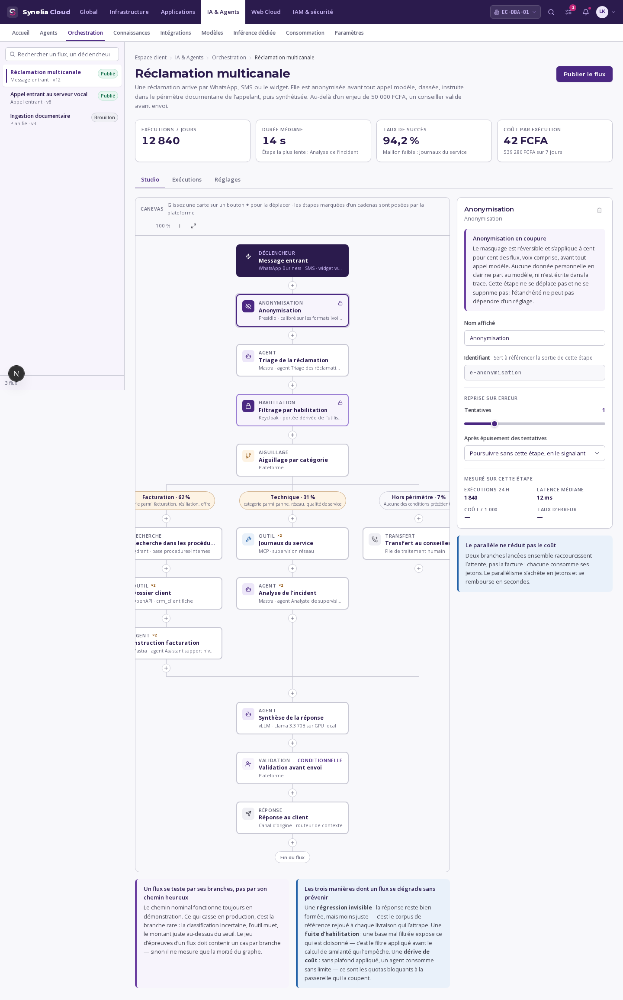

Le studio d'orchestration (`Réclamation multicanale`) construit un flux qui enchaîne plusieurs
agents et étapes en colonne verticale : déclencheur, anonymisation (verrouillée — ne peut être
déplacée ni supprimée), triage, filtrage par habilitation, aiguillage par catégorie, puis des
branches nommées avec leur part de trafic (Facturation, Technique, Hors périmètre), jusqu'à une
synthèse et une validation humaine conditionnelle avant réponse. Un panneau de configuration à
droite édite l'étape sélectionnée. Quatre indicateurs en tête (exécutions 7 jours, durée médiane,
taux de succès, coût par exécution). Bouton « Publier le flux ».

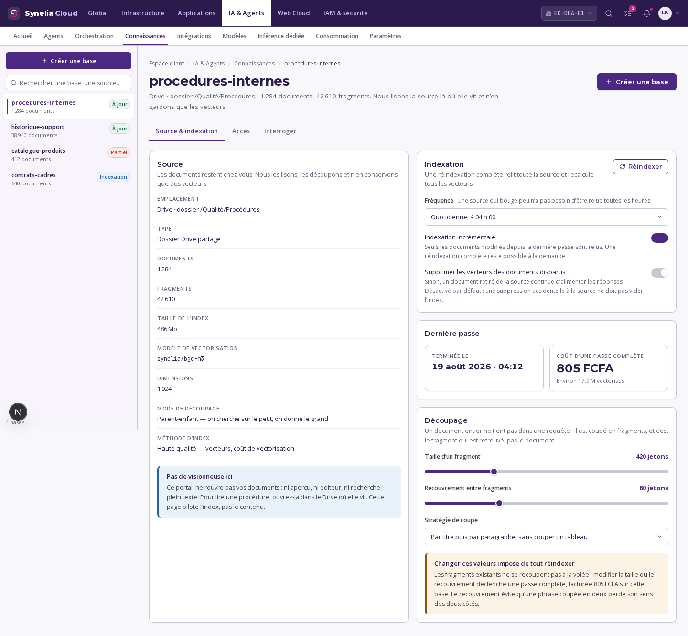

La fiche d'une base de connaissances (`procedures-internes`) montre la source (dossier Drive
partagé, nombre de documents et de fragments vectorisés), les réglages d'indexation (fréquence,
indexation incrémentale, suppression des vecteurs orphelins) et les paramètres de découpage
(taille et recouvrement des fragments, stratégie de coupe). Le portail précise qu'il ne rouvre pas
les documents sources : ni aperçu, ni recherche plein texte — cette page pilote l'index, pas le
contenu.

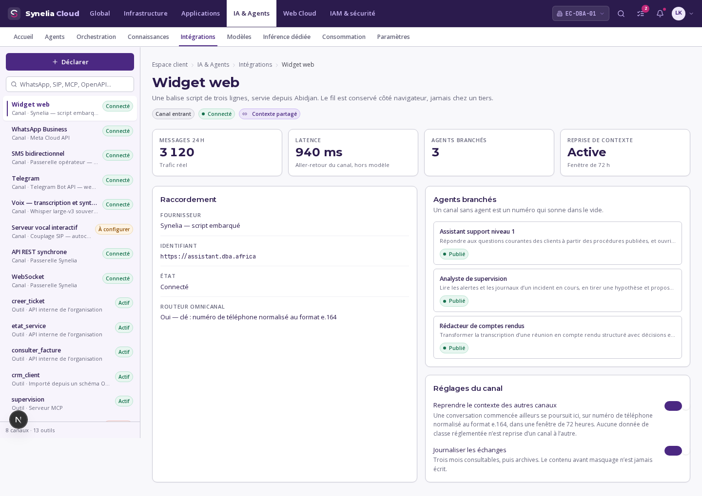

La fiche d'un canal (`Widget web`) affiche le raccordement (fournisseur, identifiant, état), les
agents branchés sur ce canal, et les réglages du canal (reprise de contexte entre canaux sur une
fenêtre de 72 h, journalisation des échanges). D'autres canaux possibles apparaissent dans le
panneau de gauche : WhatsApp Business, SMS, Telegram, voix, serveur vocal interactif, API REST,
WebSocket — ainsi que des outils internes (créer un ticket, consulter une facture…).

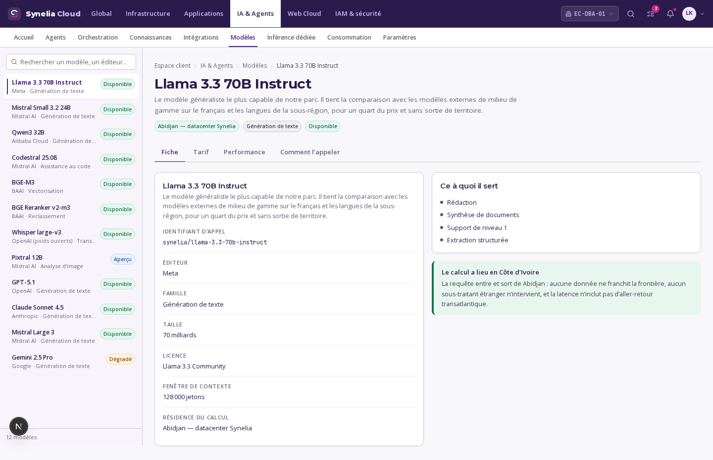

La fiche d'un modèle (`Llama 3.3 70B Instruct`) porte des onglets Fiche, Tarif, Performance,
Comment l'appeler. La fiche donne l'éditeur, la famille, la taille, la licence, la fenêtre de
contexte et la résidence du calcul — ici « Abidjan, datacenter Synelia », avec la garantie
qu'aucune donnée ne franchit la frontière.

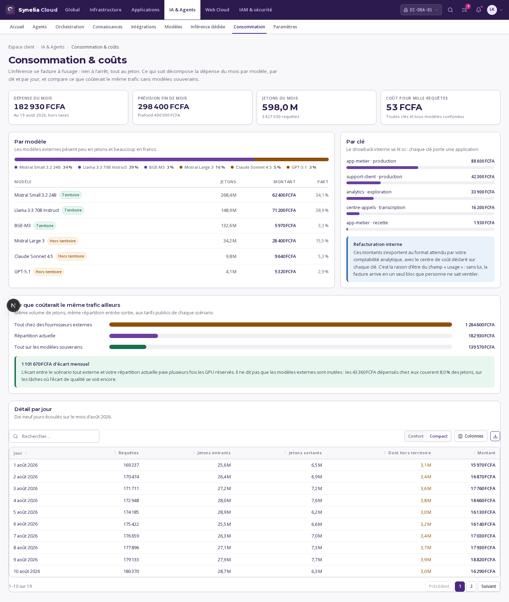

`/app/ia/consommation` décompose la dépense du mois par modèle, par clé et par jour, et compare ce
que coûterait le même trafic entièrement chez des fournisseurs externes ou entièrement sur des
modèles souverains — la refacturation interne par clé s'exporte au format attendu par la
comptabilité analytique.

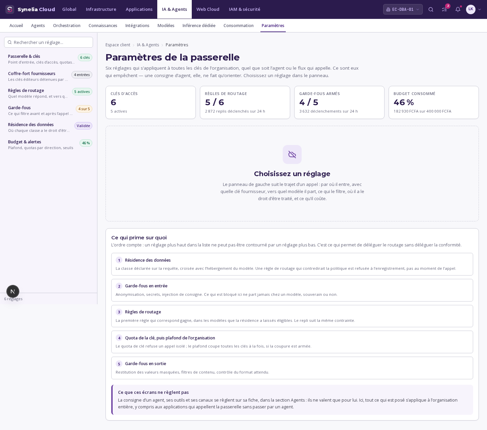

`/app/ia/parametres` liste six réglages fixes qui s'appliquent à toute l'organisation, dans
l'ordre où ils s'appliquent à un appel : Résidence des données (priorité 1, ne peut être
contournée par un réglage plus bas), Garde-fous en entrée, Règles de routage, Quota de clé puis
plafond d'organisation, Garde-fous en sortie, et le Coffre-fort fournisseurs.

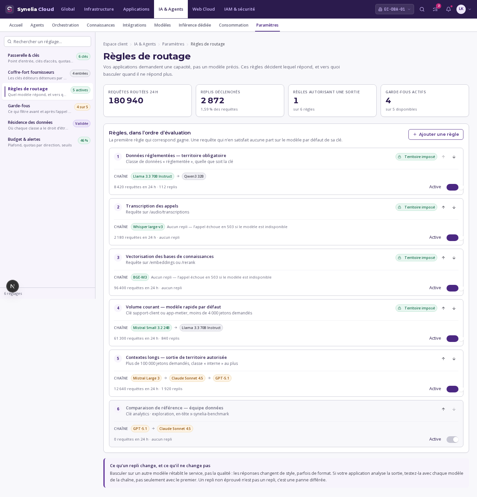

Le détail « Règles de routage » liste les règles dans leur ordre d'évaluation (la première qui
correspond gagne), chacune avec sa condition, sa chaîne de modèles (principal puis replis) et le
volume de requêtes routées. Certaines règles sont marquées « Territoire imposé » et ne peuvent
pas être désactivées.

---

## 7. IAM & sécurité et Global

### Membres

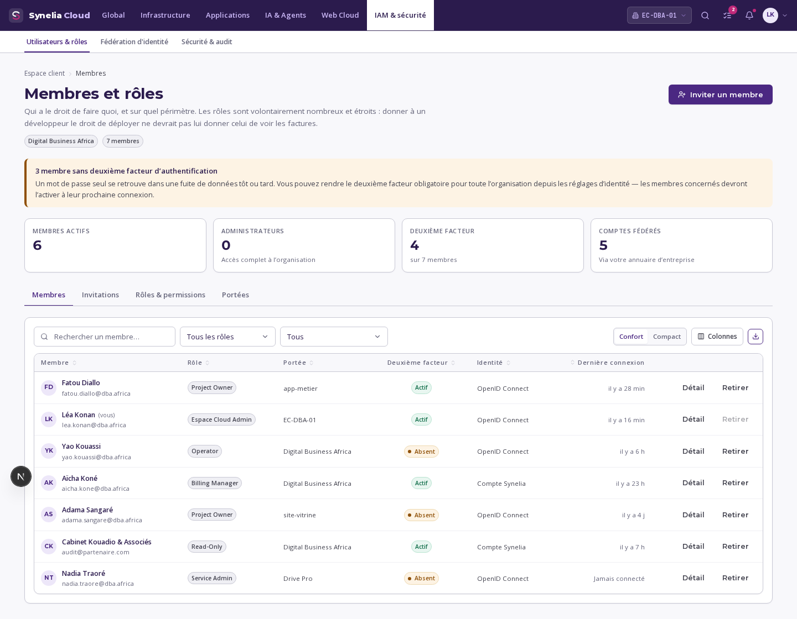

`/app/membres` liste les membres de l'organisation avec leur rôle, leur portée (toute
l'organisation, un Espace Cloud ou un projet précis), l'état de leur deuxième facteur et leur
méthode d'identité (fédérée ou compte Synelia). Onglets Membres, Invitations, Rôles &
permissions, Portées. Bouton « Inviter un membre ».

### SSO

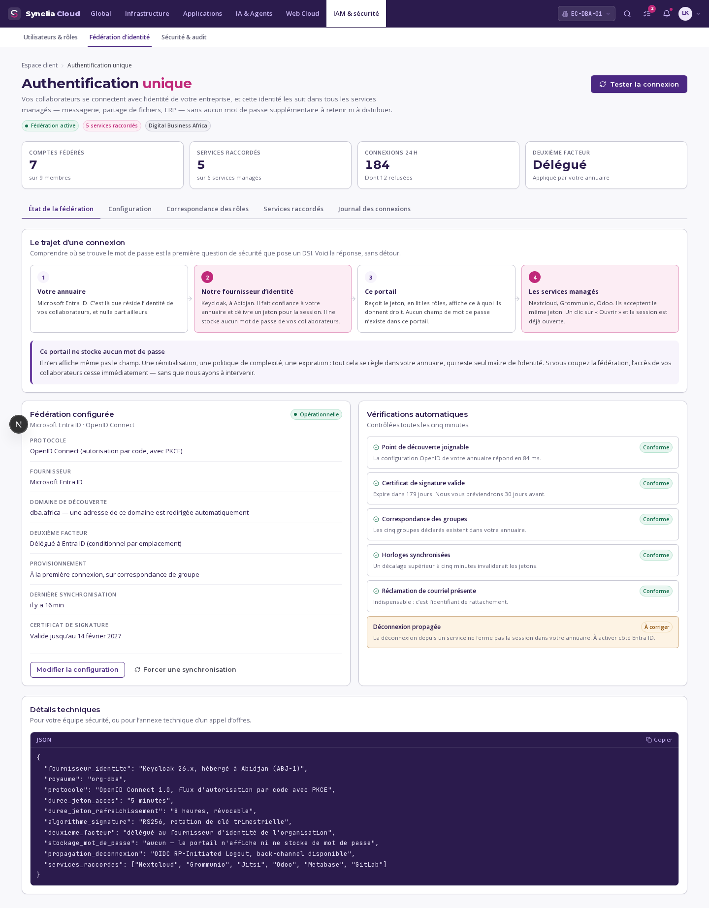

`/app/sso` configure la fédération d'identité (ici Microsoft Entra ID via OpenID Connect). Le
schéma « trajet d'une connexion » explique où réside le mot de passe (dans l'annuaire de
l'entreprise, jamais dans le portail) ; des vérifications automatiques contrôlent toutes les cinq
minutes le point de découverte, le certificat de signature, la correspondance des groupes et
l'horloge. Onglets État de la fédération, Configuration, Correspondance des rôles, Services
raccordés, Journal des connexions.

### Sécurité & audit

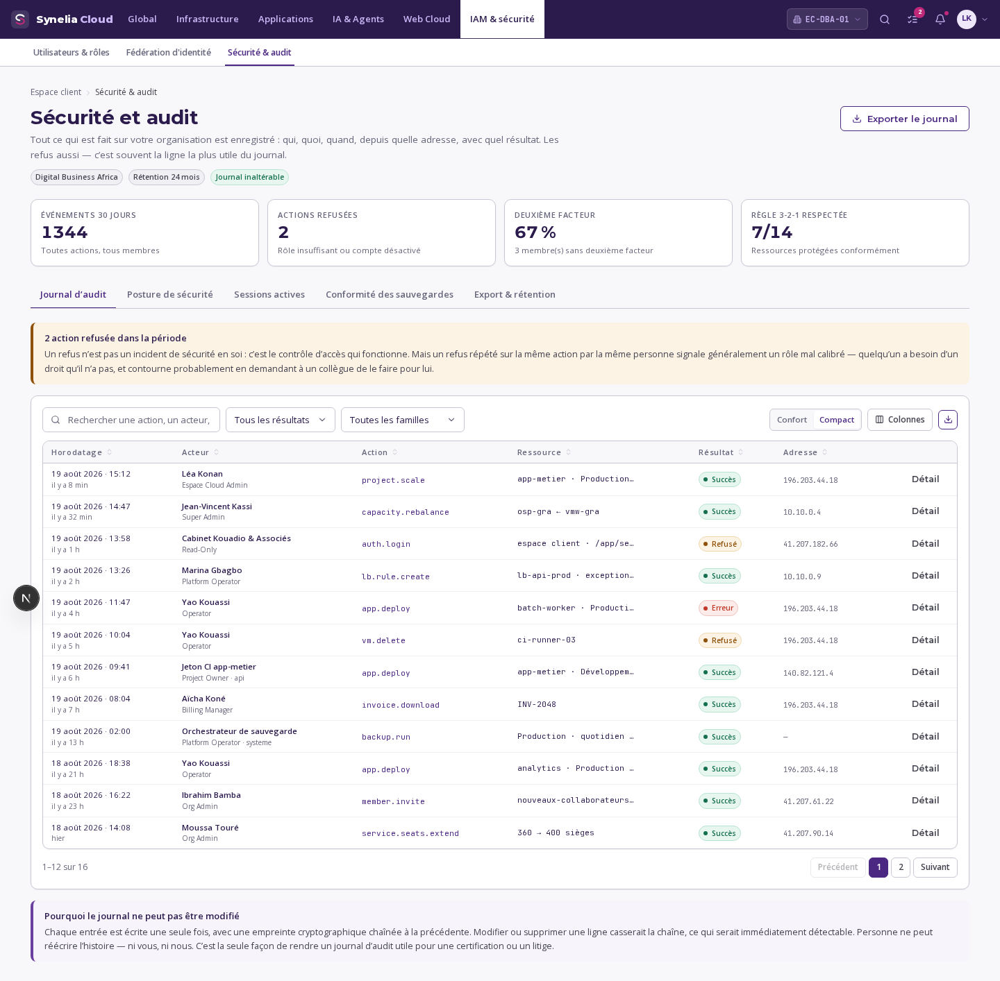

`/app/securite` tient le journal inaltérable de tout ce qui est fait sur l'organisation (acteur,
action, ressource, résultat, adresse IP), y compris les refus de droits. Chaque entrée est chaînée
cryptographiquement à la précédente : personne ne peut réécrire l'historique. Onglets Journal
d'audit, Posture de sécurité, Sessions actives, Conformité des sauvegardes, Export & rétention.
Bouton « Exporter le journal ».

### Paramètres (organisation)

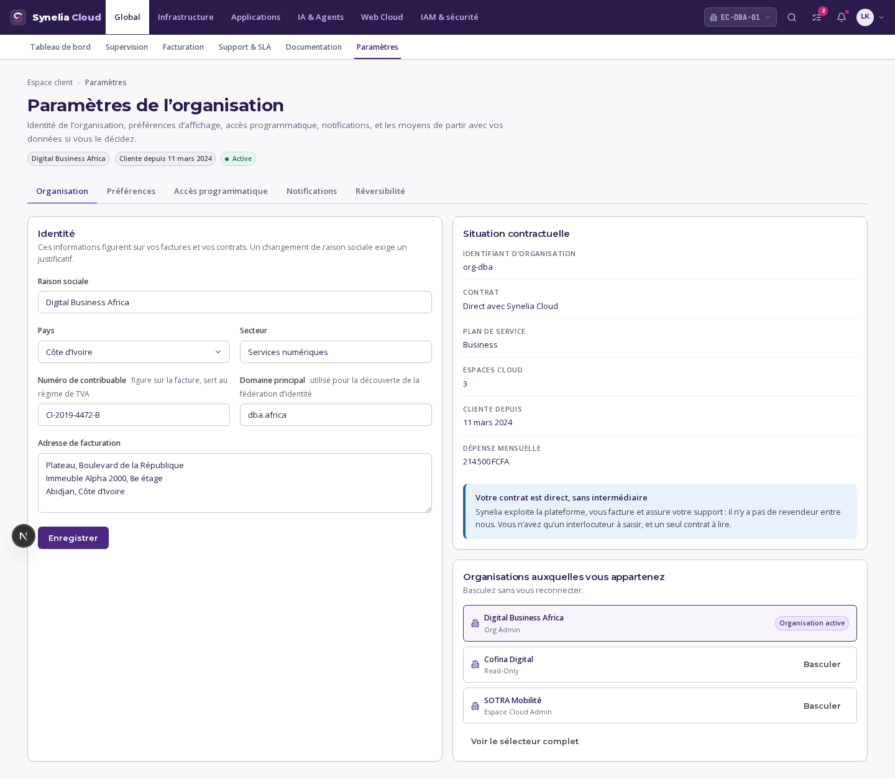

`/app/parametres` (univers Global) porte l'identité de l'organisation (raison sociale, pays,
secteur, numéro de contribuable, adresse de facturation), la situation contractuelle (plan de
service, nombre d'Espaces Cloud, dépense mensuelle) et le sélecteur d'organisations auxquelles
l'utilisateur appartient, pour basculer sans se reconnecter. Onglets Organisation, Préférences,
Accès programmatique, Notifications, Réversibilité.

### Facturation

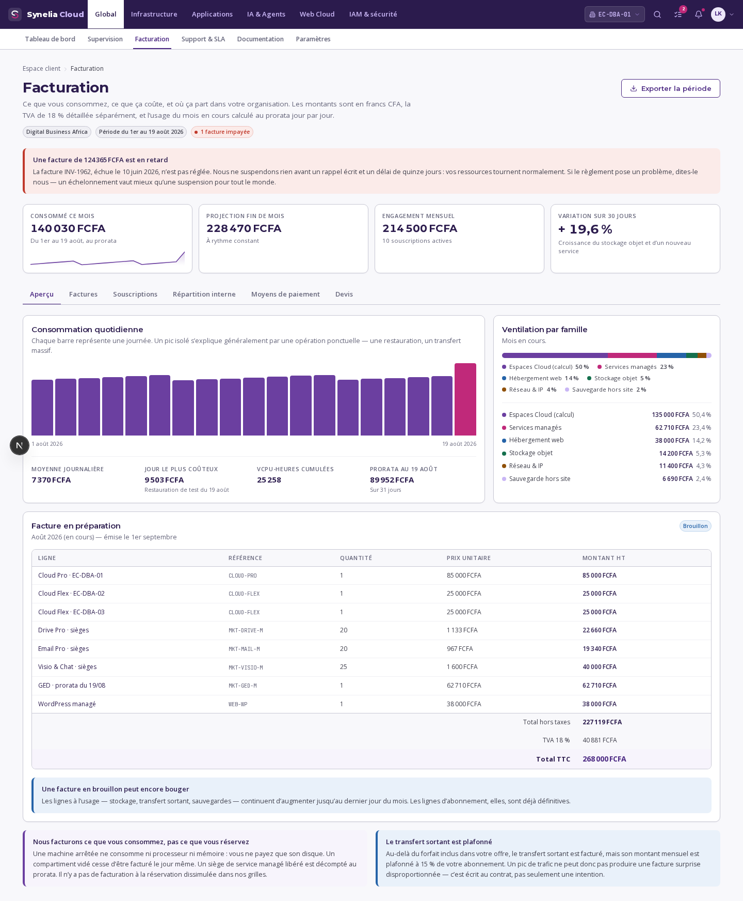

`/app/facturation` (univers Global) affiche la consommation quotidienne, la ventilation par
famille de service (Espaces Cloud, services managés, hébergement web, stockage objet, réseau,
sauvegarde hors site), et la facture en préparation ligne par ligne avec son total HT/TVA/TTC.
Une facture en retard est signalée en tête avec le principe de recouvrement (relance avant
suspension). Onglets Aperçu, Factures, Souscriptions, Répartition interne, Moyens de paiement,
Devis.

### Support

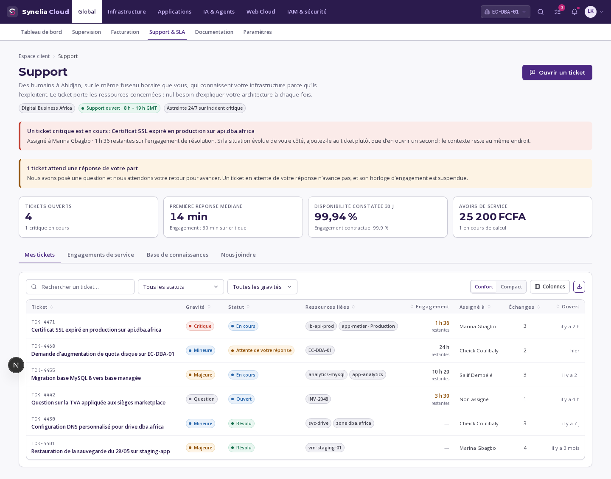

`/app/support` (univers Global, « Support & SLA ») liste les tickets ouverts avec gravité, statut,
ressources liées, temps restant sur l'engagement de résolution et personne assignée. Quatre
compteurs (tickets ouverts, première réponse médiane, disponibilité constatée sur 30 jours, avoirs
de service). Bouton « Ouvrir un ticket ».

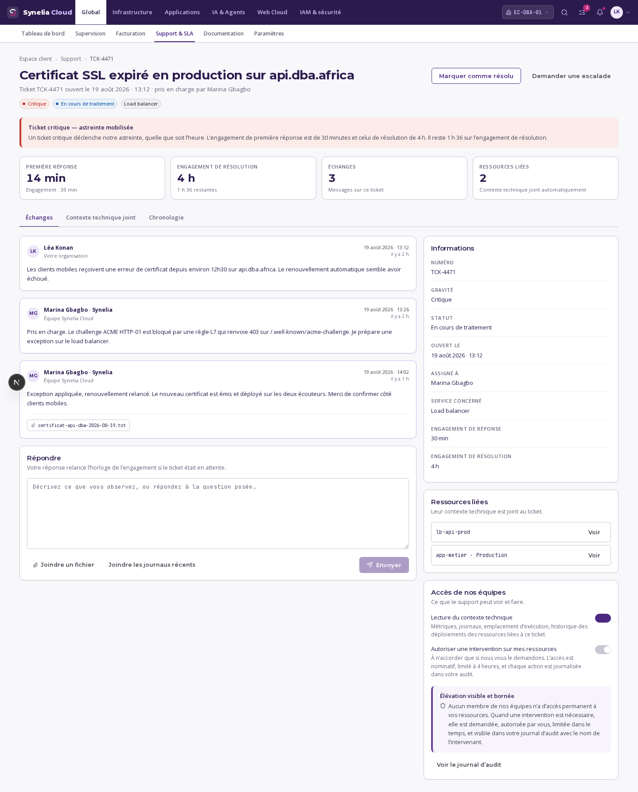

La fiche d'un ticket (`TCK-4471`, critique) affiche le fil d'échanges avec pièces jointes, les
informations de suivi (gravité, engagements de réponse et de résolution, temps restant), les
ressources techniques liées et un contrôle explicite des accès du support (lecture du contexte
technique activée par défaut, intervention sur les ressources désactivée par défaut et nominative
si accordée) — chaque accès accordé apparaît dans le journal d'audit du client.

### Documentation

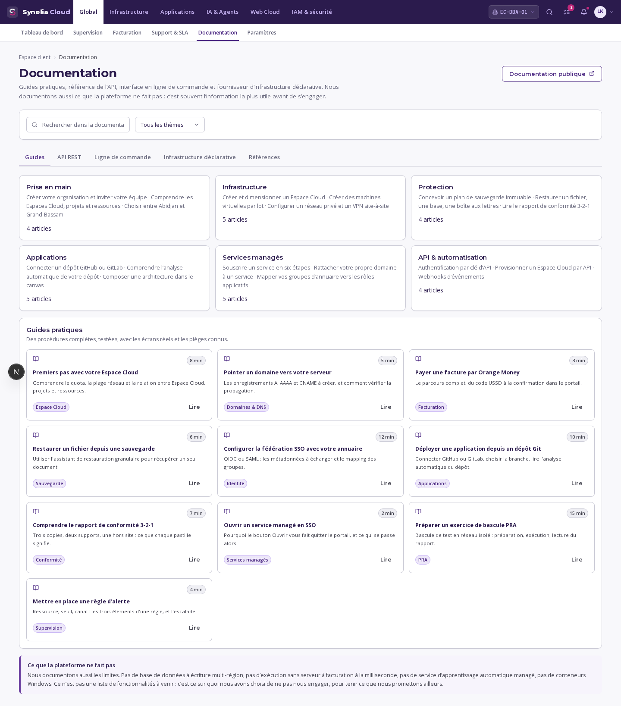

`/app/docs` centralise guides pratiques, référence API REST, ligne de commande et infrastructure
déclarative, organisés par thème (Prise en main, Infrastructure, Protection, Applications,
Services managés, API & automatisation) avec un temps de lecture estimé par guide. Une section
« Ce que la plateforme ne fait pas » liste explicitement les limites assumées (pas de base à
écriture multi-région, pas de conteneurs Windows…).

---

## 8. Super admin

L'espace super admin (`/admin`) est réservé à l'équipe qui exploite la plateforme pour tous les
clients. Six univers : Pilotage, Clients, Infrastructure, Produit, Finance, Exploitation.

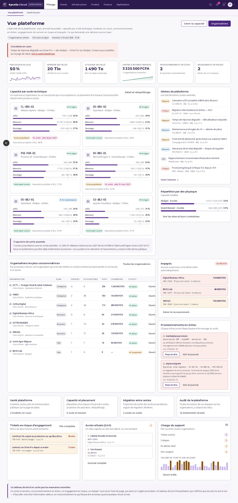

`/admin` (Pilotage) est le tableau de bord toutes organisations confondues : incidents en cours,
capacité par socle technique (six hyperviseurs/clouds privés avec leur trajectoire de sortie pour
les socles propriétaires), alertes de plateforme, organisations les plus consommatrices, impayés,
provisionnements en échec, tickets en risque d'engagement et charge du support. Un encart de
principe conclut la page : « ce tableau de bord ne cache pas les mauvaises nouvelles ».

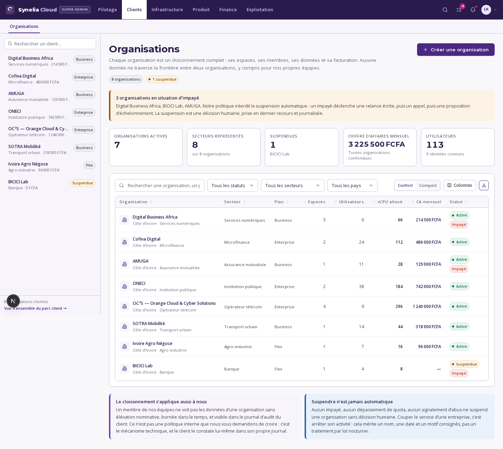

`/admin/organisations` (univers Clients) liste les organisations clientes avec secteur, plan,
Espaces, utilisateurs, vCPU alloué, CA mensuel et statut (active/suspendue, impayé). Le
cloisonnement est total entre organisations, y compris pour les équipes Synelia. Bouton
« Créer une organisation ».

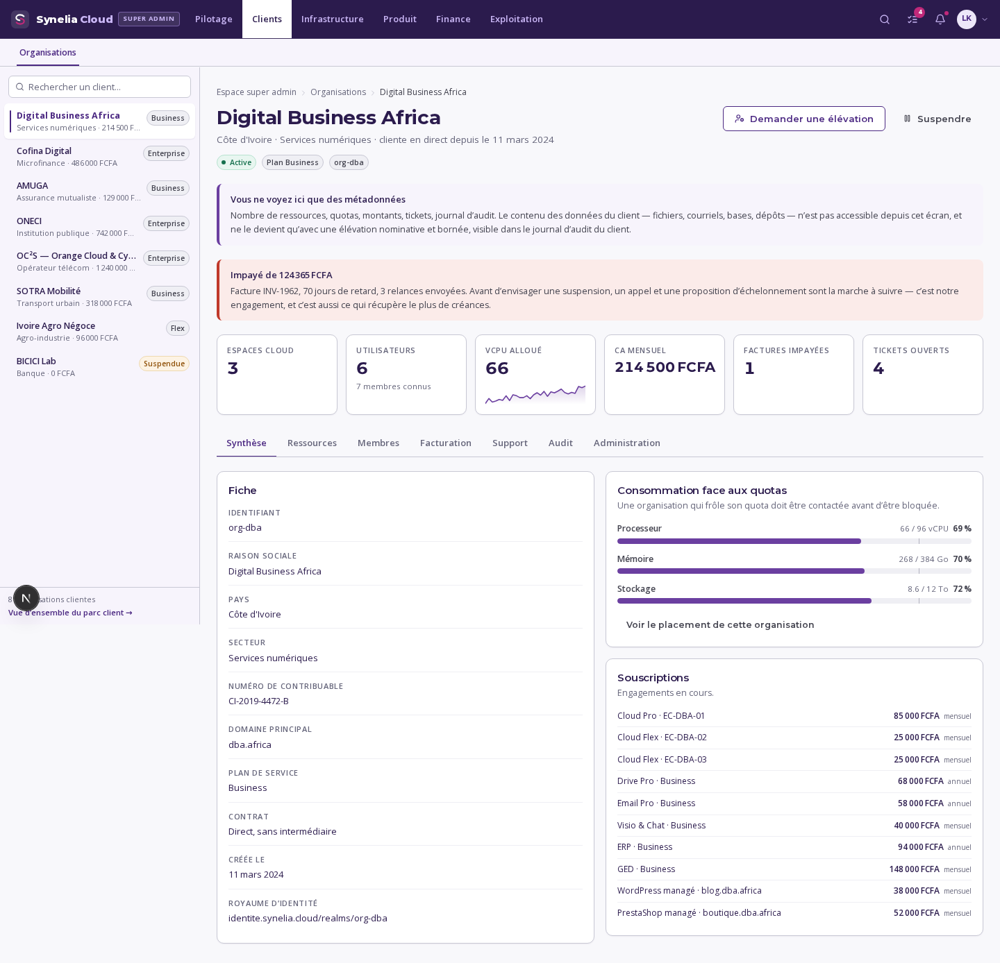

La fiche d'une organisation (`Digital Business Africa`) n'affiche que des métadonnées (nombre de
ressources, quotas, montants, tickets, journal d'audit) — le contenu des données du client
(fichiers, courriels, bases) reste inaccessible sans élévation nominative et bornée dans le temps,
visible dans le journal d'audit du client. Onglets Synthèse, Ressources, Membres, Facturation,
Support, Audit, Administration. Boutons « Demander une élévation » et « Suspendre ».

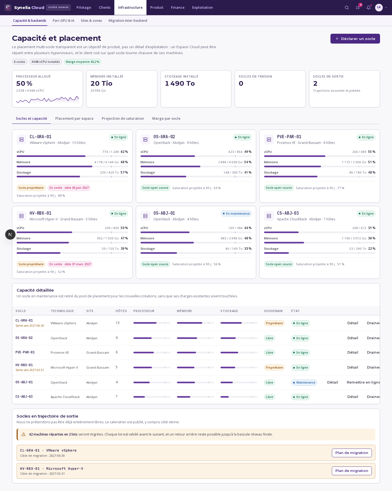

`/admin/capacite` (univers Infrastructure) donne la capacité et le taux d'occupation de chaque
socle technique (VMware vSphere, OpenStack, Proxmox VE, Microsoft Hyper-V, Apache CloudStack), la
saturation projetée à 90 jours, et la trajectoire de sortie assumée pour les socles propriétaires
(dates cibles publiées, y compris côté vitrine publique). Bouton « Déclarer un socle ».

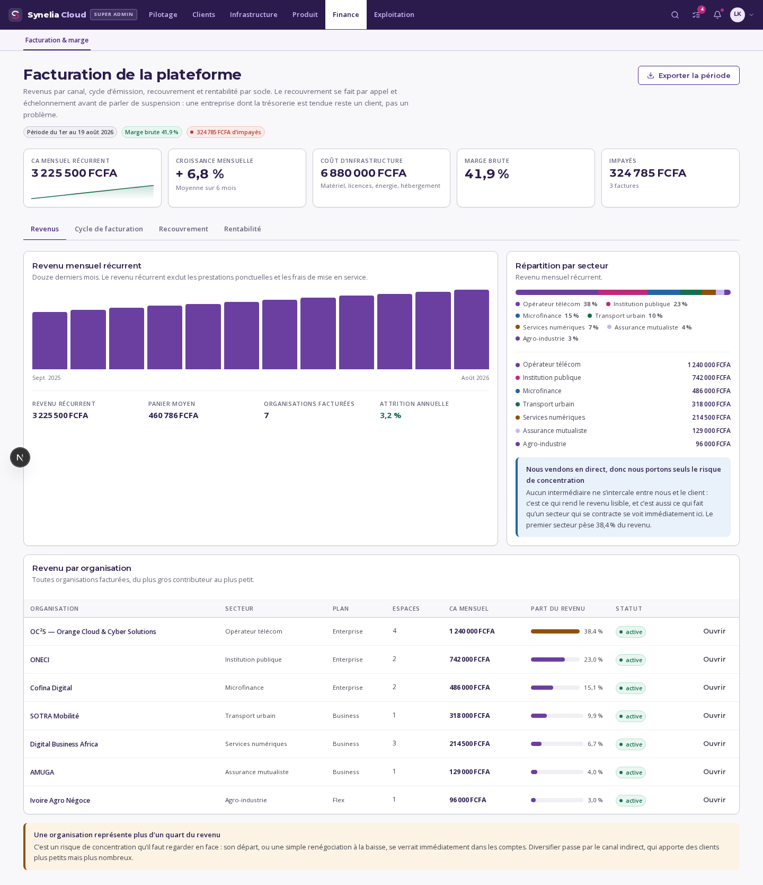

`/admin/facturation` (univers Finance) agrège le chiffre d'affaires récurrent, la marge brute, le
coût d'infrastructure et les impayés toutes organisations confondues, avec la répartition du
revenu par secteur et par organisation — un encart signale explicitement le risque de
concentration quand une organisation pèse plus d'un quart du revenu.

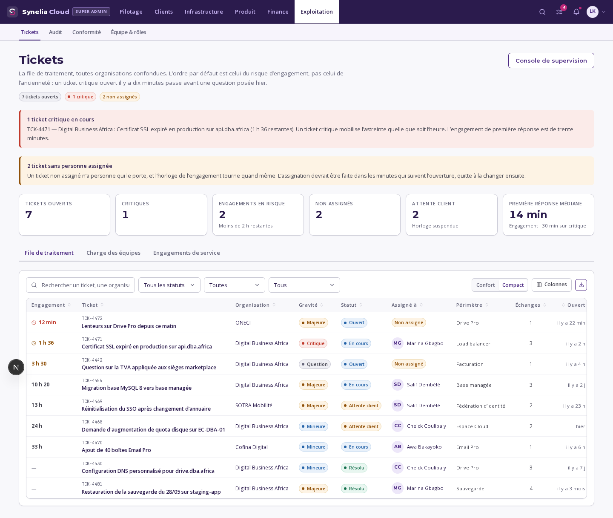

`/admin/tickets` (univers Exploitation) est la file de traitement toutes organisations confondues,
triée par risque d'engagement plutôt que par ancienneté. Un ticket sans personne assignée continue
de faire tourner l'horloge d'engagement — c'est signalé explicitement. Onglets File de traitement,
Charge des équipes, Engagements de service.

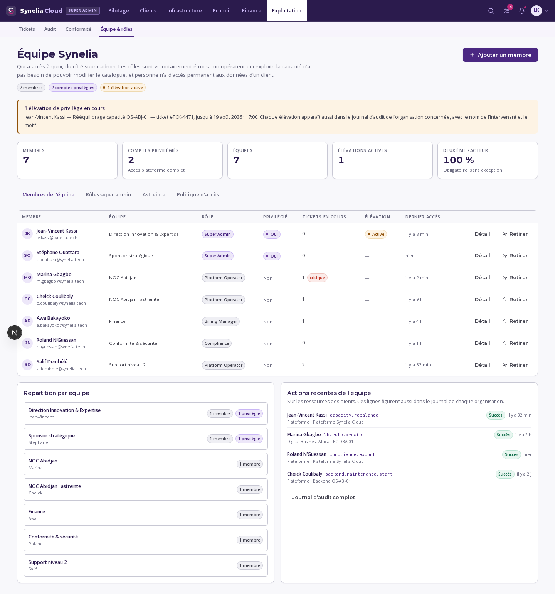

`/admin/equipe` (univers Exploitation) gère qui, côté fournisseur, a accès à quoi : membres,
rôles (Super Admin, Platform Operator, Billing Manager, Compliance…), comptes privilégiés,
élévations actives (avec la ressource concernée, le ticket qui la justifie et son expiration), et
l'astreinte. Chaque action de l'équipe sur une ressource cliente apparaît aussi dans le journal
de l'organisation concernée.
